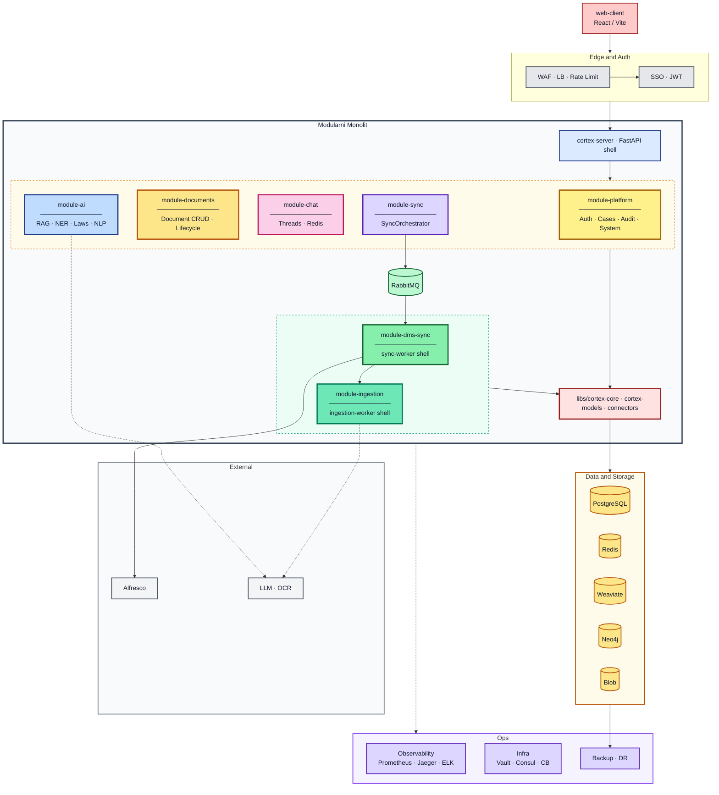

# Cortex AI Modularni Monolit - Pregled Arhitekture

Ovaj dokument opisuje kako je monolit organizovan po paketima, koji je plan razvoja `cortex-core` biblioteke i kako ce se sistem postepeno pripremati za izdvajanje novih biblioteka i nezavisnih servisa.

> Plan refactora (big-bang): [REFACTOR-PLAN.md](REFACTOR-PLAN.md)  
> Onboarding tima: [docs/onboarding/README.md](docs/onboarding/README.md)

## 1) Visok nivo arhitekture (ciljna produkcija)

Tok zahteva i podataka:

1. `web-client` ide kroz edge sloj (WAF → LB → Rate Limiter) i auth (SSO → JWT).
2. `cortex-server` montira routove svih HTTP modula: platform, documents, chat, sync, ai.
3. `sync-worker` podize `module-dms-sync`, `ingestion-worker` podize `module-ingestion`.
4. Svi moduli dele `cortex-core`, `cortex-models`, `cortex-connectors`.
5. `module-documents` je jedini vlasnik `Document.status` (lifecycle metode).
6. `module-sync` drzi `SyncOrchestrator` i enqueue-uje sync task.
7. `module-dms-sync` vuče delta iz Alfresco, koristi `DocumentsModule` za metadata, Blob za fajlove.
8. `module-ingestion` radi OCR → chunk → embed → Weaviate preko `SearchPort`.
9. `module-ai` koristi LangGraph agente (RAG, NER, Laws, NLP) i cita iz Weaviate-a.
10. `module-chat` persistuje thread-ove u Redis-u; AI generise stream.

## 2) Podela paketa na pocetku aplikacije

### Aplikacioni shell sloj

- `apps/cortex-server`
  - Composition root: podize FastAPI app, ukljucuje rout-ove i middleware.
  - Treba da ostane tanak orchestration sloj bez domenske logike.
- `apps/sync-worker` i `apps/ingestion-worker`
  - Odvojeni Celery deployable-i (I/O vs CPU/GPU profil).
  - Domenska logika u `module-dms-sync` i `module-ingestion`.

### Domen/feature moduli

- `packages/module-platform` — auth, cases, audit, system
- `packages/module-documents` — Document CRUD + lifecycle (jedini menja status)
- `packages/module-chat` — chat threads, Redis persistence
- `packages/module-sync` — SyncOrchestrator, job trigger/polling
- `packages/module-dms-sync` — DMS delta sync → Blob + PG (bivši alfresco)
- `packages/module-ingestion` — OCR/chunk/embed pipeline, Weaviate write
- `packages/module-ai` — LangGraph agenti (rag, legal, nlp podfolderi)

### Deljeni lib sloj

- `libs/cortex-core` — ports (SearchPort, AlfrescoPort, OCRPort, LLM), celery, settings
- `libs/cortex-models` — ORM (User, Case, Document, SyncJob, AuditLog)
- `libs/cortex-connectors` — Alfresco, Blob, OCR adapter stubs
- `libs/cortex-observability` — metrics/tracing hooks (stub)

## 3) Smer razvoja `cortex-core` biblioteke

Predlog faznog razvoja:

1. **Stabilizacija contract-a**
  - Standardizovati port interfejse i domenske greske.
  - Uvesti konzistentne timeout/retry politike.
2. **Observability-first core**
  - Dodati telemetry hooks (latency, retries, queue depth, failures).
  - Obezbediti shared correlation-id mehanizam.
3. **Testabilnost i provider-agnostic pristup**
  - Jasni fake/stub adapteri za LLM, OCR, DMS i embedding.
  - Portovi da omoguce zamenu implementacija bez promene domena.
4. **Versioned core API**
  - Semver pravila za `cortex-core`.
  - Deprecation politika pre lomljenja API-ja.

## 4) Potencijalna prosirenja i izdvajanje novih biblioteka

### Nove biblioteke (u okviru monolita i mikroservisa)

- `cortex-ai-kits` (prompt templates, response parsing, guardrails)
- `cortex-observability` (logging/tracing/metrics helperi)
- `cortex-connectors` (uniformni adapteri za DMS i storage konektore)
- `cortex-doc-pipeline` (shared chunking/embedding utility bez hard dependency na runtime)

### Kandidati za nezavisne servise

- **AI runtime servis**
  - Razlog: odvojeno skaliranje chat/RAG opterecenja i GPU/LLM cost control.
- **Ingestion servis**
  - Razlog: odvojeni throughput profil i batch obrada.
- **Connector/sync servis**
  - Razlog: izolacija spoljasnjih API limita i credentials lifecycle-a.

## 5) Nezavisni servisi i integracije

- `PostgreSQL` - transakcioni podaci (users, cases, documents, audit, sync jobs)
- `Redis` - cache/session, chat i Celery result backend
- `RabbitMQ` - message broker za Celery queue-e
- `Weaviate` - hybrid pretraga (BM25 + vector) i RAG retrieval
- `Neo4j` - law graph sada, general graph kasnije
- `Blob Storage` - S3/MinIO za originalne fajlove posle sync-a
- `Alfresco` - izvor istine za dokumente

## 6) Tehnologije ukljucene u trenutno resenje

- **Backend/API:** Python 3.12, FastAPI, Uvicorn
- **Async processing:** Celery, Flower
- **Data access:** SQLAlchemy 2.x, psycopg3
- **Security/Auth:** JWT (`python-jose`)
- **HTTP i integracije:** `httpx`, Redis client, Neo4j driver, Weaviate client
- **Frontend:** React web-client (Vite/pnpm tok)
- **Build i dev:** `uv` workspace, Makefile orchestration, import-linter
- **Deployment:** Docker Compose (lokalno), Kubernetes/Minikube (k8s manifesti)

## 7) Arhitekturni principi koje treba zadrzati

1. Aplikacioni shell je tanak, moduli nose domenu.
2. `cortex-core` definise ports i shared contracts, ne business use-case flow.
3. Novi konektori ulaze kroz adapter sloj, ne direktno u feature API layer.
4. Ekstrakcija u mikroservise ide kada metrika (latency, queue backlog, deploy coupling) to opravda.

## 8) Dijagram (Mermaid)

> Za Mermaid Live Editor kopiraj samo sadrzaj iz [`architecture.mmd`](architecture.mmd).

### Legenda

| Vizuelni element | Značenje |
|------------------|----------|
| Veliki okvir **Modularni Monolit** | Ceo repo — 7 modula + shared libs |
| Isprekidani okvir **HTTP row** | HTTP moduli na cortex-server-u |
| Isprekidani okvir **Worker row** | Async moduli na Celery workerima |
| **cortex-core / models / connectors** | Deljeni kernel |

