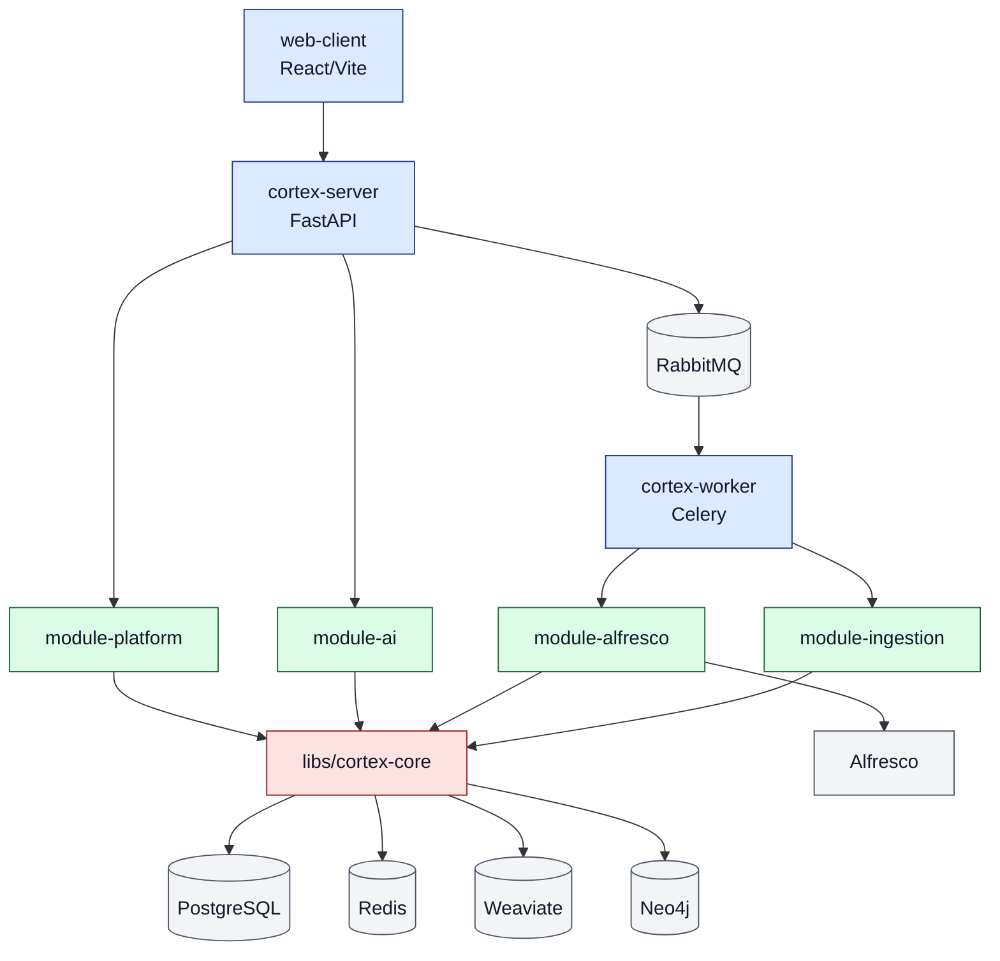

# Cortex AI Modularni Monolit - Pregled Arhitekture

Ovaj dokument opisuje kako je monolit organizovan po paketima, koji je plan razvoja `cortex-core` biblioteke i kako ce se sistem postepeno pripremati za izdvajanje novih biblioteka i nezavisnih servisa.

## 1) Visok nivo arhitekture

Tok zahteva i podataka:

1. `web-client` salje zahteve ka `cortex-server` (FastAPI).
2. `cortex-server` orkestrira `module-platform` i `module-ai` in-process.
3. Asinhroni poslovi idu preko `RabbitMQ` ka `cortex-worker` (Celery).
4. `cortex-worker` izvrsava zadatke iz `module-alfresco` i `module-ingestion`.
5. Deljeni storage/infra sloj koristi `PostgreSQL`, `Redis`, `Weaviate`, `Neo4j`.

## 2) Podela paketa na pocetku aplikacije

### Aplikacioni shell sloj

- `apps/cortex-server`
  - Composition root: podize FastAPI app, ukljucuje rout-ove i middleware.
  - Treba da ostane tanak orchestration sloj bez domenske logike.
- `apps/cortex-worker`
  - Worker bootstrap i registracija Celery app-a.
  - Domenska logika treba da ostane u modulima.

### Domen/feature moduli

- `packages/module-platform`
  - Auth, cases, documents, sync trigger, audit, system.
  - Platform modul komunicira sa AI slojem preko facade API-ja.
- `packages/module-ai`
  - Agent orchestration, chat/translation stubs, RAG pretraga, law lookup.
  - Izolovan AI domen, nezavistan od platform internals.
- `packages/module-alfresco`
  - Adapter ka Alfresco i sync taskovi.
- `packages/module-ingestion`
  - OCR/chunk/embed pipeline i upis u vector store.

### Deljeni core sloj

- `libs/cortex-core`
  - Shared settings, ports (alfresco/llm/ocr/cache), celery wiring, redis/weaviate klijenti, bazne apstrakcije.
  - Ovo je najvazniji kandidat za postepeno jacanje kao stabilan contract sloj.

## 3) Smer razvoja `cortex-core` biblioteke

Predlog faznog razvoja:

1. **Stabilizacija contract-a**
  - Standardizovati port interfejse i domenske greske.
  - Uvesti konzistentne timeout/retry politike.
2. **Observability-first core**
  - Dodati telemetry hooks (latency, retries, queue depth, failures).
  - Obezbediti shared correlation-id mehanizam.
3. **Testabilnost i provider-agnostic pristup**
  - Jasni fake/stub adapteri za LLM, OCR, DMS i embedding.
  - Portovi da omoguce zamenu implementacija bez promene domena.
4. **Versioned core API**
  - Semver pravila za `cortex-core`.
  - Deprecation politika pre lomljenja API-ja.

## 4) Potencijalna prosirenja i izdvajanje novih biblioteka

### Nove biblioteke (u okviru monolita i mikroservisa)

- `cortex-ai-kits` (prompt templates, response parsing, guardrails)
- `cortex-observability` (logging/tracing/metrics helperi)
- `cortex-connectors` (uniformni adapteri za DMS i storage konektore)
- `cortex-doc-pipeline` (shared chunking/embedding utility bez hard dependency na runtime)

### Kandidati za nezavisne servise

- **AI runtime servis**
  - Razlog: odvojeno skaliranje chat/RAG opterecenja i GPU/LLM cost control.
- **Ingestion servis**
  - Razlog: odvojeni throughput profil i batch obrada.
- **Connector/sync servis**
  - Razlog: izolacija spoljasnjih API limita i credentials lifecycle-a.

## 5) Nezavisni servisi i integracije

- `PostgreSQL` - transakcioni podaci (users, cases, documents, audit, sync jobs)
- `Redis` - cache/session i Celery result backend
- `RabbitMQ` - message broker za queue-e
- `Weaviate` - vector pretraga i RAG retrieval
- `Neo4j` - pravni graf i relacije
- `Alfresco` - izvor dokumenata / sync endpoint

## 6) Tehnologije ukljucene u trenutno resenje

- **Backend/API:** Python 3.12, FastAPI, Uvicorn
- **Async processing:** Celery, Flower
- **Data access:** SQLAlchemy 2.x, psycopg3
- **Security/Auth:** JWT (`python-jose`)
- **HTTP i integracije:** `httpx`, Redis client, Neo4j driver, Weaviate client
- **Frontend:** React web-client (Vite/pnpm tok)
- **Build i dev:** `uv` workspace, Makefile orchestration, import-linter
- **Deployment:** Docker Compose (lokalno), Kubernetes/Minikube (k8s manifesti)

## 7) Arhitekturni principi koje treba zadrzati

1. Aplikacioni shell je tanak, moduli nose domenu.
2. `cortex-core` definise ports i shared contracts, ne business use-case flow.
3. Novi konektori ulaze kroz adapter sloj, ne direktno u feature API layer.
4. Ekstrakcija u mikroservise ide kada metrika (latency, queue backlog, deploy coupling) to opravda.

## 8) Dijagram (Mermaid)

