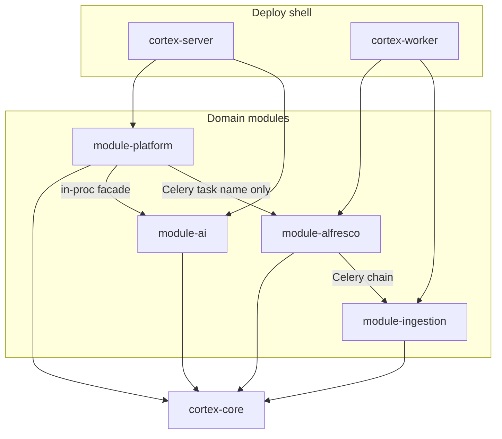

# Modularni monolit — granice modula

`arhitektura-monolit/` je **modularni monolit**: jedan deploy (`cortex-server` + `cortex-worker`), četiri domenska modula iznad `cortex-core`.

## Dijagram



## Struktura repoa

```
arhitektura-monolit/
├── libs/
│   └── cortex-core/              # shared kernel (lib)
├── packages/
│   ├── module-platform/
│   │   └── module_platform/
│   │       ├── routes/           # auth, cases, documents, sync, chat, audit, system
│   │       ├── schemas/
│   │       ├── models/           # ORM re-exports (Phase 2: own tables)
│   │       ├── services/
│   │       ├── repositories/
│   │       ├── deps.py
│   │       └── api.py
│   ├── module-ai/
│   │   └── module_ai/
│   │       ├── routes/           # rag, laws, translate
│   │       ├── schemas/
│   │       ├── models/
│   │       ├── services/
│   │       ├── agents/
│   │       └── api.py
│   ├── module-alfresco/
│   │   └── module_alfresco/
│   │       ├── tasks.py          # Celery entrypoints (no HTTP)
│   │       ├── schemas/
│   │       ├── models/
│   │       ├── services/
│   │       └── adapters/
│   └── module-ingestion/
│       └── module_ingestion/     # isti layout kao alfresco
├── apps/
│   ├── cortex-server/            # include_router + app.state wiring
│   └── cortex-worker/
```

**Konvencija:** `libs/` = deljeni kernel; `packages/` = domenski moduli (uv workspace paketi).

### Učitavanje ruta

```python
# apps/cortex-server/cortex_server/main.py
app.state.platform_module = platform_module
app.state.ai_module = ai_module
app.include_router(platform_router)
app.include_router(ai_router)
```

Moduli registruju `APIRouter` u `routes/`; `cortex-server` samo montira routere i postavlja `app.state` za dependency injection.

## Javni API (`api.py`)

Svaki modul izlaže **jednu** ulaznu tačku. Interni `services/`, `adapters/`, `repositories/` nisu za direktan import iz drugih modula.

| Modul | Facade | DTO |
|-------|--------|-----|
| `module-platform` | `PlatformModule` | `module_platform/schemas.py` |
| `module-ai` | `AiModule` | `module_ai/schemas.py` |
| `module-alfresco` | `tasks.py` | Celery: `sync_case_from_alfresco`, `finalize_sync_job` |
| `module-ingestion` | `tasks.py` | Celery: `ingest_document` |

## Pravila zavisnosti

| Modul | Sme da zavisi od |
|-------|------------------|
| `module-platform` | `cortex-core`, `module-ai.api` |
| `module-ai` | `cortex-core` |
| `module-alfresco` | `cortex-core` |
| `module-ingestion` | `cortex-core` |
| `cortex-server` | sva 4 modula (preko `api.py`) + `cortex-core` |
| `cortex-worker` | `module-alfresco`, `module-ingestion`, `cortex-core` |

**Zabranjeno:**

- `module-ai` → `module-platform`
- `module-alfresco` → `module-ingestion` (lanac ide preko Celery task imena, ne importa)
- bilo koji modul → `cortex_server.*` / `cortex_worker.*` interni kod
- `module-platform` → `module_ai.services` / `module_ai.agents` (samo `module_ai.api`)

Enforcement: `make lint-imports` (import-linter konfig u root `pyproject.toml`).

## Celery task imena

Centralna konvencija u `cortex_core.messaging.tasks`:

| Konstanta | Task name |
|-----------|-----------|
| `TASK_SYNC_CASE` | `module_alfresco.tasks.sync_case_from_alfresco` |
| `TASK_INGEST_DOCUMENT` | `module_ingestion.tasks.ingest_document` |
| `TASK_FINALIZE_SYNC` | `module_alfresco.tasks.finalize_sync_job` |

`module-platform` enqueue-uje sync preko `sync_trigger.py` — šalje samo task name, bez Alfresco logike.

Worker koristi `cortex_core.worker_celery.get_worker_celery_app()` da izbegne ciklične importe.

## Extract u mikroservis (mentalni test)

`module-ai` se može zamisliti kao zaseban `ai-agents` servis:

1. Kopiraj `packages/module-ai/` u novi repo
2. U `PlatformModule` zameni `AiModule()` HTTP klijentom (isti DTO iz `cortex-core`)
3. K8s doda `ai-agents` deployment — **ostali moduli ostaju u monolitu**

Isti pattern važi za `module-alfresco` → `sync-worker`, `module-ingestion` → `ingestion-worker`.

## K8s

**Bez promena** — namespace `cortex-monolith`, isti podovi, NodePort `:30081`. Modularnost je repo/runtime wiring, ne novi deploy.
