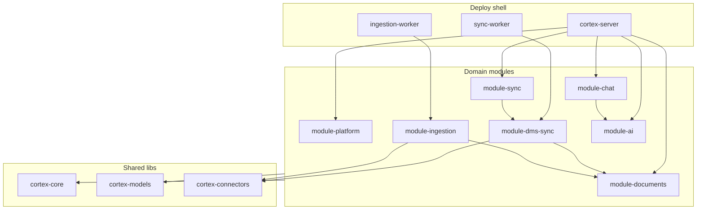

# Modularni monolit — granice modula

`arhitektura-monolit/` je **modularni monolit**: `cortex-server` + `sync-worker` + `ingestion-worker`, sedam domenskih modula iznad shared lib-ova.

> Plan refactora: [REFACTOR-PLAN.md](REFACTOR-PLAN.md)

## Dijagram



## Struktura repoa

```
arhitektura-monolit/
├── libs/
│   ├── cortex-core/
│   ├── cortex-models/
│   ├── cortex-connectors/
│   └── cortex-observability/
├── packages/
│   ├── module-platform/      # auth, cases, audit, system
│   ├── module-documents/     # Document CRUD + lifecycle
│   ├── module-chat/          # chat threads, Redis
│   ├── module-sync/          # SyncOrchestrator, job API
│   ├── module-dms-sync/      # DMS delta sync (bivši alfresco)
│   ├── module-ingestion/     # OCR, chunk, embed, Weaviate
│   └── module-ai/            # LangGraph agenti
├── apps/
│   ├── cortex-server/
│   ├── sync-worker/
│   └── ingestion-worker/
```

## Javni API (`api.py`)

| Modul | Facade | DTO |
|-------|--------|-----|
| `module-platform` | `PlatformModule` | `module_platform/schemas/` |
| `module-documents` | `DocumentsModule` | `module_documents/schemas/` |
| `module-chat` | `ChatModule` | `module_chat/schemas/` |
| `module-sync` | `SyncModule` | `module_sync/schemas/` |
| `module-ai` | `AiModule` | `module_ai/schemas/` |
| `module-dms-sync` | `tasks.py` | Celery: `sync_case_from_dms`, `finalize_sync_job` |
| `module-ingestion` | `tasks.py` | Celery: `ingest_document` |

## Pravila zavisnosti

| Modul | Sme da zavisi od |
|-------|------------------|
| `module-platform` | `cortex-core`, `cortex-models`, `module-ai.api` |
| `module-documents` | `cortex-core`, `cortex-models` |
| `module-chat` | `cortex-core`, `module-ai.api` |
| `module-sync` | `cortex-core`, `cortex-models` |
| `module-dms-sync` | `cortex-core`, `cortex-models`, `cortex-connectors`, `module-documents.api` |
| `module-ingestion` | `cortex-core`, `cortex-models`, `cortex-connectors`, `module-documents.api` |
| `module-ai` | `cortex-core` (SearchPort read) |
| `cortex-server` | svi moduli preko `api.py` + routova |
| `sync-worker` | `module-dms-sync`, `cortex-core` |
| `ingestion-worker` | `module-ingestion`, `cortex-core` |

**Zabranjeno:**

- bilo koji modul → interni kod drugog modula (samo `.api`)
- worker moduli → direktan ORM write na `Document.status` (samo `DocumentsModule`)
- `module-dms-sync` → `module-ingestion` (lanac preko Celery task imena)

Enforcement: `make lint-imports`

## Celery task imena

| Konstanta | Task name |
|-----------|-----------|
| `TASK_SYNC_CASE` | `module_dms_sync.tasks.sync_case_from_dms` |
| `TASK_INGEST_DOCUMENT` | `module_ingestion.tasks.ingest_document` |
| `TASK_FINALIZE_SYNC` | `module_dms_sync.tasks.finalize_sync_job` |

## Document lifecycle

Samo `module-documents` menja `Document.status`. Worker moduli pozivaju `DocumentsModule.mark_syncing()`, `mark_ingesting()`, `mark_ready()`, `mark_failed()`.

## Hexagonal layout (P3)

Moduli sa `ports/` + `adapters/` + `register.py`:

| Modul | Hexagonal status |
|-------|------------------|
| `module-documents` | pun pilot (`DocumentRepositoryPort`, `DocumentService`) |
| `module-platform` | `IdentityProviderPort`, `AuthService` |
| `module-chat` | `ChatStorePort` → `RedisChatStore` |
| `module-dms-sync` | `register.py`; shared portovi u `cortex-connectors` |
| `module-ingestion` | `register.py`; OCR/Search preko `cortex-core` ports |
| `module-sync` | `SyncOrchestrator` u `services/` |
| `module-ai` | agenti + `SearchPort` read |

Vidi [docs/onboarding/hexagonal-layout.md](docs/onboarding/hexagonal-layout.md).

## Extract u mikroservis

Isti pattern kao pre: kopiraj modul u novi repo, zameni in-proc facade HTTP klijentom, dodaj K8s deployment.
