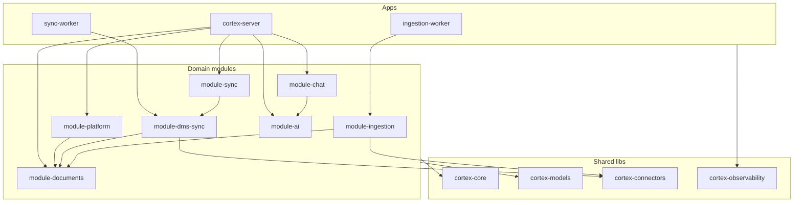
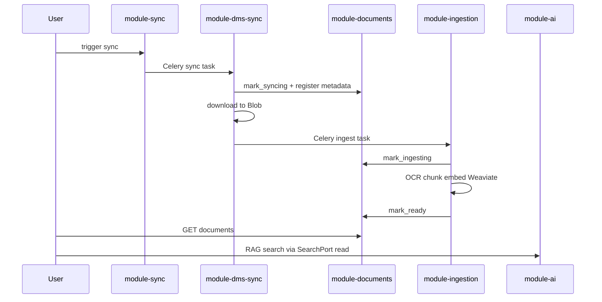

# Monolith Refactor Plan

Referentni dokument pre big-bang refactora modularnog monolita. Pokriva arhitektonske odluke, ciljnu strukturu, pravila zavisnosti, document lifecycle i checklist za validaciju.

Povezani dokumenti:

- [ARCHITECTURE_OVERVIEW.md](ARCHITECTURE_OVERVIEW.md) — ciljna arhitektura i dijagram
- [MODULE-BOUNDARIES.md](MODULE-BOUNDARIES.md) — granice modula (ažurirati posle refactora)
- [architecture.mmd](architecture.mmd) — Mermaid dijagram

---

## 1. Kontekst i motivacija

Trenutno stanje: **4 domenska modula** (`module-platform`, `module-ai`, `module-alfresco`, `module-ingestion`) + **1 worker app** (`cortex-worker`) iznad `cortex-core`.

Identifikovani problemi:

1. **Document vlasništvo rasuto** — `Document` ORM i status pišu platform, alfresco i ingestion moduli.
2. **Platform preširok** — auth, cases, documents, chat, sync, audit i AI delegacija u jednom `PlatformModule`.
3. **Duplirani ORM** — worker moduli imaju kopije/re-export `Document`, `Case`, `SyncJob` modela.
4. **Weaviate adapter dupliran** — read u AI, write u ingestion, bez zajedničkog contract-a.
5. **Ime `module-alfresco`** — vezuje modul za jedan DMS; cilj je DMS-agnostic sync.
6. **Jedan worker deployable** — sync i ingestion imaju različit I/O vs CPU profil; treba split.

Cilj refactora: **7 modula + 3 nova lib paketa + 2 worker app-a**, jasne granice, jedan ORM izvor istine, facade po modulu.

---

## 2. Zaključane odluke

| Tema | Odluka |
|------|--------|
| Document vlasništvo | Novi `module-documents` — pun CRUD; **samo on** menja `Document.status` |
| Platform split | `module-chat` + `module-sync`; `module-platform` → auth, cases, audit, system |
| Facades | Svaki modul ima svoj `api.py`; shell samo montira routove |
| Chat | `module-chat` persistuje (Redis); `module-ai` generiše stream |
| Weaviate | `SearchPort` u `cortex-core`; ingestion=write, ai=read |
| DMS modul | `module-alfresco` → **`module-dms-sync`** |
| Core rast | Novi `libs/cortex-connectors` + `libs/cortex-observability` |
| ORM | Novi **`libs/cortex-models`** — jedan izvor istine |
| Sync flow | `SyncOrchestrator` u `module-sync`; workeri = executors |
| Messaging | Ostaje Celery task queue (bez domain events) |
| AI struktura | Jedan `module-ai`, podfolderi `agents/rag`, `agents/legal`, `agents/nlp` |
| Deploy | `apps/sync-worker` + `apps/ingestion-worker` (ukloniti `cortex-worker`) |
| API | Može lomljenje — dokumentovano u sekciji 10 |
| Enforcement | Import-linter odmah ažuriran |
| Implementacija | Big-bang PR, logički red u sekciji 9 |

---

## 3. Ciljna struktura repoa

```
arhitektura-monolit/
├── libs/
│   ├── cortex-core/           # ports, enums, SearchPort, celery conv, settings
│   ├── cortex-models/         # User, Case, Document, SyncJob, AuditLog ORM
│   ├── cortex-connectors/     # Alfresco, Blob, OCR adapter impl
│   └── cortex-observability/  # metrics/tracing/logging hooks
├── packages/
│   ├── module-platform/       # auth, cases, audit, system
│   ├── module-documents/      # Document CRUD + lifecycle facade
│   ├── module-chat/           # threads, Redis, chat routes
│   ├── module-sync/           # SyncOrchestrator, job trigger/polling
│   ├── module-dms-sync/       # delta sync → Blob + PG (bivši alfresco)
│   ├── module-ingestion/      # OCR → chunk → embed → Weaviate
│   └── module-ai/
│       └── agents/
│           ├── rag/
│           ├── legal/
│           └── nlp/
└── apps/
    ├── cortex-server/         # tanak composition root
    ├── sync-worker/           # Celery -Q sync
    └── ingestion-worker/      # Celery -Q ingestion
```

---

## 4. Dijagrami

### 4.1 Zavisnosti modula



### 4.2 Document lifecycle



**Pravilo:** worker moduli ne rade direktan ORM write na `Document.status` — pozivaju `DocumentsModule` lifecycle metode.

---

## 5. Pravila zavisnosti (import-linter)

| Modul | Sme da zavisi od |
|-------|------------------|
| `module-platform` | `cortex-core`, `cortex-models`, `module-documents.api`, `module-chat.api`, `module-sync.api`, `module-ai.api` |
| `module-documents` | `cortex-core`, `cortex-models` |
| `module-chat` | `cortex-core`, `module-ai.api` |
| `module-sync` | `cortex-core`, `cortex-models`, `module-documents.api` |
| `module-dms-sync` | `cortex-core`, `cortex-models`, `cortex-connectors`, `module-documents.api` |
| `module-ingestion` | `cortex-core`, `cortex-models`, `cortex-connectors`, `module-documents.api`, SearchPort |
| `module-ai` | `cortex-core`, SearchPort (read) |

**Zabranjeno:**

- bilo koji modul → interni kod drugog modula (samo `.api` i `schemas` preko facade DTO)
- worker moduli → direktan ORM write na `Document.status` (samo `module-documents.api`)
- `module-ai` → platform / documents / sync / dms-sync / ingestion
- `module-dms-sync` → `module-ingestion` (lanac preko Celery task imena)

**Celery task konstante** (`cortex_core.messaging.tasks`):

| Konstanta | Task name |
|-----------|-----------|
| `TASK_SYNC_CASE` | `module_dms_sync.tasks.sync_case_from_dms` |
| `TASK_INGEST_DOCUMENT` | `module_ingestion.tasks.ingest_document` |
| `TASK_FINALIZE_SYNC` | `module_dms_sync.tasks.finalize_sync_job` |

---

## 6. Mapiranje fajlova (staro → novo)

| Izvor (danas) | Odredište |
|---------------|-----------|
| `packages/module-platform/module_platform/models/*` | `libs/cortex-models/cortex_models/` |
| `module_platform/routes/documents.py` | `module-documents/module_documents/routes/` |
| `module_platform/routes/chat.py` + `infrastructure/chat_store.py` | `module-chat/` |
| `module_platform/routes/sync.py` + `sync_trigger.py` + `SyncService` | `module-sync/` |
| `module_platform/api.py` (documents/chat/sync deo) | Facades u novim modulima |
| `packages/module-alfresco/` | `packages/module-dms-sync/` (rename) |
| `module_alfresco/adapters/alfresco_client.py` | `cortex-connectors` + thin wrapper |
| `module_ai/adapters/weaviate_store.py` + ingestion write | `SearchPort` u core + modul adapteri |
| `module_ai/agents/*` | `agents/rag/`, `agents/legal/`, `agents/nlp/` |
| `apps/cortex-worker/` | `apps/sync-worker/` + `apps/ingestion-worker/` |

---

## 7. DocumentsModule API (lifecycle)

Javni facade u `module-documents/module_documents/api.py`:

### CRUD (HTTP)

| Metoda | Opis |
|--------|------|
| `list_by_case(case_id, user)` | Lista dokumenata za slučaj (auth check preko case ownership) |
| `get(document_id, user)` | Detalj dokumenta |
| `create(case_id, metadata)` | Registracija novog dokumenta (internal/worker poziv) |
| `delete(document_id, user)` | Brisanje (soft delete kasnije) |
| `trigger_reingest(document_id, user)` | Re-ingest enqueue |

### Lifecycle (samo internal — worker pozivi)

| Metoda | Status prelaz | Ko zove |
|--------|---------------|---------|
| `mark_syncing(document_id)` | → `syncing` | `module-dms-sync` |
| `mark_ingesting(document_id)` | → `ingesting` | `module-ingestion` |
| `mark_ready(document_id, *, page_count?)` | → `ready` | `module-ingestion` |
| `mark_failed(document_id, reason)` | → `failed` | bilo koji worker |

---

## 8. SyncOrchestrator odgovornosti

`module-sync` drži `SyncOrchestrator` i `SyncModule` facade:

1. **trigger_sync(case_id, user)** — kreira `SyncJob(PENDING)`, audit log, enqueue `TASK_SYNC_CASE`
2. **get_job(job_id, user)** — polling status za frontend
3. **Koordinacija** — zna redosled: sync task → (dms-sync enqueue-uje ingest) → finalize

Workeri (`module-dms-sync`, `module-ingestion`) su **dumb executors** — ne kreiraju SyncJob, samo ažuriraju progress i pozivaju documents lifecycle.

`sync_trigger.py` i `SyncService` iz platforme prelaze u `module-sync`.

---

## 9. Redosled implementacije (big-bang checklist)

- [x] **Faza 1 — Foundation libs**
  - [x] `libs/cortex-models`
  - [x] `libs/cortex-connectors`
  - [x] `libs/cortex-observability`
  - [x] `SearchPort` u `cortex-core`

- [x] **Faza 2 — Novi moduli**
  - [x] `module-documents`
  - [x] `module-chat`
  - [x] `module-sync`

- [x] **Faza 3 — Refactor postojećih**
  - [x] `module-alfresco` → `module-dms-sync`
  - [x] `module-ingestion`
  - [x] `module-ai`
  - [x] `module-platform`

- [x] **Faza 4 — Apps i tooling**
  - [x] `apps/sync-worker` + `apps/ingestion-worker`
  - [x] Uklonjen `apps/cortex-worker` iz workspace-a
  - [x] `pyproject.toml` + import-linter
  - [x] `Makefile`
  - [x] K8s — dva worker deployment-a

- [x] **Faza 5 — Docs**
  - [x] `MODULE-BOUNDARIES.md`
  - [x] `architecture.mmd`
  - [x] `ARCHITECTURE_OVERVIEW.md`
  - [x] `docs/onboarding/` + hexagonal layout (P0–P3 plan implementiran)

---

## 10. API breaking changes

| Oblast | Pre | Posle |
|--------|-----|-------|
| Documents | `module-platform` routes | `module-documents` router |
| Chat | `module-platform` routes | `module-chat` router |
| Sync | `module-platform` routes | `module-sync` router |
| RAG / Laws / Translate | `module-ai` routes | ostaje u `module-ai` |

`cortex-server/main.py` montira sve routere:

```python
app.include_router(platform_router)
app.include_router(documents_router)
app.include_router(chat_router)
app.include_router(sync_router)
app.include_router(ai_router)
```

---

## 11. Makefile / K8s / Docker promene

### Makefile

```makefile
dev-sync-worker:
	uv run celery -A sync_worker.tasks:celery_app worker -Q sync -n sync@%h

dev-ingestion-worker:
	uv run celery -A ingestion_worker.tasks:celery_app worker -Q ingestion -n ingest@%h

dev:
	# server + sync-worker + ingestion-worker + flower + web
```

### K8s

| Pre | Posle |
|-----|-------|
| `infra/k8s/cortex-worker/` | `infra/k8s/sync-worker/` + `infra/k8s/ingestion-worker/` |
| 1 worker pod | 2 worker pod-a (različit queue profil) |
| Flower koristi `cortex-worker` image | Flower koristi `sync-worker` ili shared worker image |

---

## 12. Validaciona checklist

### 12.1 Arhitektura (spremno za tim)

- [x] `make lint-imports` prolazi
- [x] `make flct` / `uv run poe ci` prolazi
- [x] `uv sync --all-packages` bez grešaka
- [x] Worker DI: `create_documents_module()` + `worker_deps.py`
- [x] K8s manifesti: 2 worker deployment-a
- [x] Nema dupliranih ORM modela u worker paketima (cortex-models)
- [x] Dokumentacija: [docs/ARCHITECTURE-READY.md](docs/ARCHITECTURE-READY.md), [docs/onboarding/prvi-feature.md](docs/onboarding/prvi-feature.md)
- [ ] `make dev` — server + oba worker-a + flower + web (ručni smoke, pre većeg feature-a)

### 12.2 Produkt (tim implementira feature-e)

- [ ] Sync flow: trigger → dms-sync → ingestion → document status `ready`
- [ ] RAG search radi preko SearchPort (produkcijski adapter)
- [ ] Chat: persist u module-chat, stream iz module-ai (E2E)
- [ ] Pravi AD/OIDC tenant

---

## 13. Rizici i rollback

| Rizik | Mitigacija |
|-------|------------|
| Big-bang prevelik PR | Logički red u fazi 9; commit po fazi unutar PR-a |
| Import-linter ciklične zavisnosti | Facade-only cross-module imports |
| Celery task rename | Ažurirati konstante u `cortex_core.messaging.tasks` |
| K8s downtime | Deploy oba worker-a pre brisanja starog |

**Rollback:** zadržati git tag pre merge-a; `cortex-worker` app može privremeno ostati dok se ne validira split.

---

## 14. Šta namerno NE radimo (sada)

- Domain events (`DocumentSynced`, `DocumentReady`) — ostaje Celery chain
- Saga/state machine u Redis-u — `SyncOrchestrator` je dovoljan
- Više AI paketa (rag/legal/nlp kao odvojeni deployable-i)
- Mikroservisni extract — ostaje mentalni test u MODULE-BOUNDARIES
