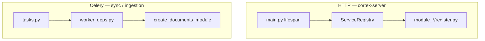

# Arhitektura — spremno za development tim

Ovaj dokument definiše kada je **arhitektura** spremna da tim piše prve linije feature koda. To je odvojeno od **produktne** spremnosti (prave integracije, pun E2E).

## Definition of Done — arhitektura

| Kriterijum | Status |
|------------|--------|
| 7 modula + import-linter (10/10) | Obavezno |
| `make flct` / `uv run poe ci` zeleno | Obavezno |
| HTTP composition root (`ServiceRegistry` + `register.py`) | Obavezno |
| Worker composition root (`create_documents_module`, `worker_deps.py`) | Obavezno |
| ORM samo u `cortex-models` | Obavezno |
| Onboarding docs + hexagonal vodič | Obavezno |
| Alembic baseline | Obavezno |

## Definition of Done — produkt (tim kasnije)

| Kriterijum | Van opsega arhitekture |
|------------|------------------------|
| Pravi AD/OIDC tenant | Faza 2 auth |
| Pravi Alfresco / Blob / OCR / LLM | `cortex-connectors` prod adapteri |
| Pun E2E sync → ingestion → `ready` | Feature tim + integracioni testovi |
| OpenTelemetry u produkciji | Observability faza |

## Dva composition root-a



- **HTTP:** `apps/cortex-server/cortex_server/main.py` → `register_services(registry)` po modulu.
- **Worker:** `module_dms_sync/worker_deps.py`, `module_ingestion/worker_deps.py` → `create_documents_module()`; nikad `DocumentsModule()` bez servisa.

## Šta je stub (namerno)

| Komponenta | Lokacija | Napomena |
|------------|----------|----------|
| Auth login | `module-platform` mock JWT | `AUTH_MOCK_ENABLED=true`, user `hmueller` |
| AD SSO | `StubIdentityProvider` | Rute postoje; pravi tenant kasnije |
| Alfresco / Blob / OCR | `cortex-connectors` stub klase | `CORTEX_CONNECTORS_MODE=stub` (default) |
| LLM / embedding | `StubLLMRouter` u cortex-core | Zamena bez promene portova |
| Weaviate read/write | modul adapteri | MVP mock podaci |
| Observability | `cortex-observability` no-op | Hook-ovi spremni za OTel |

## Checklist pre prvog feature PR-a

1. Pročitaj [gde-sta-ide.md](onboarding/gde-sta-ide.md) i [prvi-feature.md](onboarding/prvi-feature.md).
2. Odredi modul vlasnika domene.
3. Novi kod: port → adapter → service → facade → route/task.
4. Cross-module samo `module_*/api.py`.
5. `Document.status` samo `DocumentsModule.mark_*` u workerima.
6. Celery: konstante iz `cortex_core.messaging.tasks`.
7. Pokreni:

```bash
cd arhitektura-monolit
make lint-imports
make flct
```

## Automatska arhitekturna validacija (CI)

`uv run poe ci` pokreće format, lint, mypy, import-linter i unit testove:

| Test | Svrha |
|------|--------|
| `test_create_documents_module` | Worker/HTTP facade factory |
| `test_mark_syncing_updates_status` | In-memory port šablon |
| `test_factory_returns_stubs_by_default` | Connector factory |
| `test_health` | Server bootstrap |

## Ručna arhitekturna validacija

```bash
make install
make lint-imports
make flct
make dev   # server + sync-worker + ingestion-worker + flower + web
```

- API: http://localhost:8000/health → `{"status":"ok"}`
- Login: `hmueller` / bilo koja lozinka (mock)
- Flower: http://localhost:5555

Ne blokira merge ako Docker nije pokrenut — koristi se pre prvog većeg feature-a.

## Import konvencija

- ORM: `from cortex_models import User, Document, ...`
- Izbegavaj: `module_platform.models` (samo re-export za legacy importe u platform routes)
- DTO: `module_{domen}/schemas/` — ne u `module-platform` za documents/chat/sync

## Povezani dokumenti

- [onboarding/README.md](onboarding/README.md)
- [onboarding/prvi-feature.md](onboarding/prvi-feature.md)
- [MODULE-BOUNDARIES.md](../MODULE-BOUNDARIES.md)
- [onboarding/hexagonal-layout.md](onboarding/hexagonal-layout.md)
