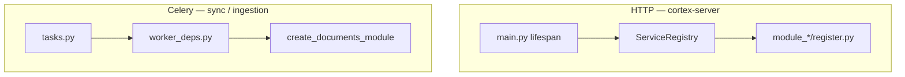

# Architecture — Ready for the Development Team

This document defines when **architecture** is ready for the team to write the first lines of feature code. This is separate from **product** readiness (real integrations, full E2E).

## Definition of Done — architecture

| Criterion | Status |
|-----------|--------|
| 7 modules + import-linter (10/10) | Required |
| `make flct` / `uv run poe ci` green | Required |
| HTTP composition root (`ServiceRegistry` + `register.py`) | Required |
| Worker composition root (`create_documents_module`, `worker_deps.py`) | Required |
| ORM only in `cortex-models` | Required |
| Onboarding docs + hexagonal guide | Required |
| Alembic baseline | Required |

## Definition of Done — product (team later)

| Criterion | Out of architecture scope |
|-----------|---------------------------|
| Real AD/OIDC tenant | Auth phase 2 |
| Real Alfresco / Blob / OCR / LLM | `cortex-connectors` prod adapters |
| Full E2E sync → ingestion → `ready` | Feature team + integration tests |
| OpenTelemetry in production | Observability phase |

## Two composition roots



- **HTTP:** `apps/cortex-server/cortex_server/main.py` → `register_services(registry)` per module.
- **Worker:** `module_dms_sync/worker_deps.py`, `module_ingestion/worker_deps.py` → `create_documents_module()`; never `DocumentsModule()` without services.

## What is stubbed (intentionally)

| Component | Location | Note |
|-----------|----------|------|
| Auth login | `module-platform` mock JWT | `AUTH_MOCK_ENABLED=true`, user `hmueller` |
| AD SSO | `StubIdentityProvider` | Routes exist; real tenant later |
| Alfresco / Blob / OCR | `cortex-connectors` stubs | `CORTEX_CONNECTORS_MODE=stub` (default) |
| LLM / embedding | `StubLLMRouter` in cortex-core | Replace without changing ports |
| Weaviate read/write | module adapters | MVP mock data |
| Observability | `cortex-observability` no-op | Hooks ready for OTel |

## Checklist before first feature PR

1. Read [feature-placement.md](../how-we-work/feature-placement.md) and [first-feature.md](../how-we-work/first-feature.md).
2. Identify the owning domain module.
3. New code: port → adapter → service → facade → route/task.
4. Cross-module only `module_*/api.py`.
5. `Document.status` only `DocumentsModule.mark_*` in workers.
6. Celery: constants from `cortex_core.messaging.tasks`.
7. Run:

```bash
make lint-imports
make flct
```

## Automated architecture validation (CI)

`uv run poe ci` runs format, lint, mypy, import-linter, and unit tests:

| Test | Purpose |
|------|---------|
| `test_create_documents_module` | Worker/HTTP facade factory |
| `test_mark_syncing_updates_status` | In-memory port template |
| `test_factory_returns_stubs_by_default` | Connector factory |
| `test_health` | Server bootstrap |

## Manual architecture validation

```bash
make install
make lint-imports
make flct
make dev   # server + sync-worker + ingestion-worker + flower + web
```

- API: http://localhost:8000/health → `{"status":"ok"}`
- Login: `hmueller` / any password (mock)
- Flower: http://localhost:5555

Does not block merge if Docker is not running — use before the first larger feature.

## Import conventions

- ORM: `from cortex_models import User, Document, ...`
- Errors: `from cortex_core.errors import ForbiddenError, ...`
- DTO: `module_{domain}/schemas/` — not in `module-platform` for documents/chat/sync

## Related documents

- [engineering/README.md](../README.md)
- [how-we-work/first-feature.md](../how-we-work/first-feature.md)
- [module-boundaries.md](module-boundaries.md)
- [how-we-work/hexagonal-layout.md](../how-we-work/hexagonal-layout.md)
