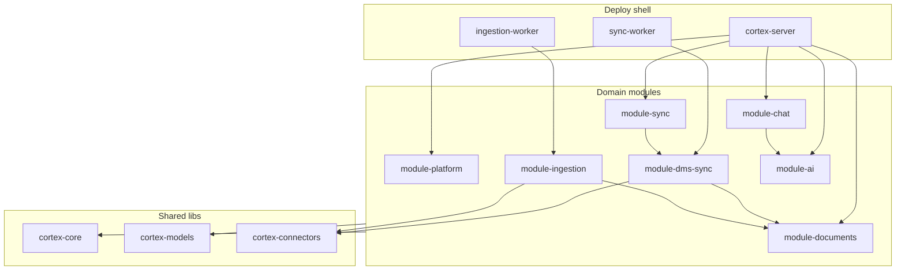

# Modular Monolith — Module Boundaries

This repository is a **modular monolith**: `cortex-server` + `sync-worker` + `ingestion-worker`, seven domain modules above shared libs.

> Architectural decisions: [decisions/README.md](../decisions/README.md)

## Diagram



## Repo structure

```
.
├── libs/
│   ├── cortex-core/
│   ├── cortex-models/
│   ├── cortex-connectors/
│   └── cortex-observability/
├── packages/
│   ├── module-platform/      # auth, cases, audit, system
│   ├── module-documents/     # Document CRUD + lifecycle
│   ├── module-chat/          # chat threads, Redis
│   ├── module-sync/          # SyncOrchestrator, job API
│   ├── module-dms-sync/      # DMS delta sync (formerly alfresco)
│   ├── module-ingestion/     # OCR, chunk, embed, Weaviate
│   └── module-ai/            # LangGraph agents
├── apps/
│   ├── cortex-server/
│   ├── sync-worker/
│   └── ingestion-worker/
```

## Public API (`api.py`)

| Module | Facade | DTO |
|--------|--------|-----|
| `module-platform` | `PlatformModule` | `module_platform/schemas/` |
| `module-documents` | `DocumentsModule` | `module_documents/schemas/` |
| `module-chat` | `ChatModule` | `module_chat/schemas/` |
| `module-sync` | `SyncModule` | `module_sync/schemas/` |
| `module-ai` | `AiModule` | `module_ai/schemas/` |
| `module-dms-sync` | `tasks.py` | Celery: `sync_case_from_dms`, `finalize_sync_job` |
| `module-ingestion` | `tasks.py` | Celery: `ingest_document` |

## Dependency rules

| Module | May depend on |
|--------|---------------|
| `module-platform` | `cortex-core`, `cortex-models`, `module-ai.api` |
| `module-documents` | `cortex-core`, `cortex-models` |
| `module-chat` | `cortex-core`, `module-ai.api` |
| `module-sync` | `cortex-core`, `cortex-models` |
| `module-dms-sync` | `cortex-core`, `cortex-models`, `cortex-connectors`, `module-documents.api` |
| `module-ingestion` | `cortex-core`, `cortex-models`, `cortex-connectors`, `module-documents.api` |
| `module-ai` | `cortex-core` (SearchPort read) |
| `cortex-server` | all modules via `api.py` + routes |
| `sync-worker` | `module-dms-sync`, `cortex-core` |
| `ingestion-worker` | `module-ingestion`, `cortex-core` |

**Forbidden:**

- any module → another module's internal code (only `.api`)
- worker modules → direct ORM write on `Document.status` (only `DocumentsModule`)
- `module-dms-sync` → `module-ingestion` (chain via Celery task names)

Enforcement: `make lint-imports`

## Celery task names

| Constant | Task name |
|----------|-----------|
| `TASK_SYNC_CASE` | `module_dms_sync.tasks.sync_case_from_dms` |
| `TASK_INGEST_DOCUMENT` | `module_ingestion.tasks.ingest_document` |
| `TASK_FINALIZE_SYNC` | `module_dms_sync.tasks.finalize_sync_job` |

## Document lifecycle

Only `module-documents` changes `Document.status`. Worker modules call `DocumentsModule.mark_syncing()`, `mark_ingesting()`, `mark_ready()`, `mark_failed()`.

## Hexagonal layout (P3)

Modules with `ports/` + `adapters/` + `register.py`:

| Module | Hexagonal status |
|--------|------------------|
| `module-documents` | full pilot (`DocumentRepositoryPort`, `DocumentService`) |
| `module-platform` | `IdentityProviderPort`, `AuthService` |
| `module-chat` | `ChatStorePort` → `RedisChatStore` |
| `module-dms-sync` | `register.py`; shared ports in `cortex-connectors` |
| `module-ingestion` | `register.py`; OCR/Search via `cortex-core` ports |
| `module-sync` | `SyncOrchestrator` in `services/` |
| `module-ai` | agents + `SearchPort` read |

See [hexagonal-layout.md](../how-we-work/hexagonal-layout.md).

## Extract to microservice

Same pattern as before: copy module to new repo, replace in-proc facade with HTTP client, add K8s deployment.
