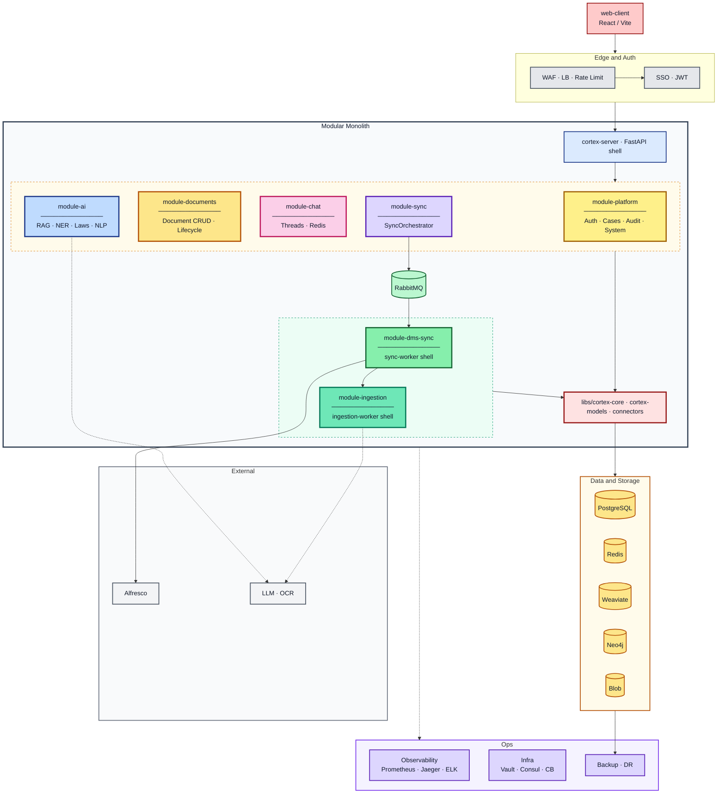

# Cortex AI Modular Monolith — Architecture Overview

This document describes how the monolith is organized by package, the development plan for the `cortex-core` library, and how the system prepares for extracting new libraries and independent services.

> Architectural decisions: [decisions/README.md](../decisions/README.md)  
> Team onboarding: [engineering/README.md](../README.md)

## 1) High-level architecture (target production)

Request and data flow:

1. `web-client` goes through edge layer (WAF → LB → Rate Limiter) and auth (SSO → JWT).
2. `cortex-server` mounts routes for all HTTP modules: platform, documents, chat, sync, ai.
3. `sync-worker` runs `module-dms-sync`, `ingestion-worker` runs `module-ingestion`.
4. All modules share `cortex-core`, `cortex-models`, `cortex-connectors`.
5. `module-documents` is the sole owner of `Document.status` (lifecycle methods).
6. `module-sync` holds `SyncOrchestrator` and enqueues sync tasks.
7. `module-dms-sync` pulls delta from Alfresco, uses `DocumentsModule` for metadata, Blob for files.
8. `module-ingestion` runs OCR → chunk → embed → Weaviate via `SearchPort`.
9. `module-ai` uses LangGraph agents (RAG, NER, Laws, NLP) and reads from Weaviate.
10. `module-chat` persists threads in Redis; AI generates the stream.

## 2) Package split at application start

### Application shell layer

- `apps/cortex-server`
  - Composition root: boots FastAPI app, includes routes and middleware.
  - Must remain a thin orchestration layer without domain logic.
- `apps/sync-worker` and `apps/ingestion-worker`
  - Separate Celery deployables (I/O vs CPU/GPU profile).
  - Domain logic in `module-dms-sync` and `module-ingestion`.

### Domain/feature modules

- `packages/module-platform` — auth, cases, audit, system
- `packages/module-documents` — Document CRUD + lifecycle (sole status owner)
- `packages/module-chat` — chat threads, Redis persistence
- `packages/module-sync` — SyncOrchestrator, job trigger/polling
- `packages/module-dms-sync` — DMS delta sync → Blob + PG (formerly alfresco)
- `packages/module-ingestion` — OCR/chunk/embed pipeline, Weaviate write
- `packages/module-ai` — LangGraph agents (rag, legal, nlp subfolders)

### Shared lib layer

- `libs/cortex-core` — ports (SearchPort, AlfrescoPort, OCRPort, LLM), celery, settings
- `libs/cortex-models` — ORM (User, Case, Document, SyncJob, AuditLog)
- `libs/cortex-connectors` — Alfresco, Blob, OCR adapter stubs
- `libs/cortex-observability` — metrics/tracing hooks (stub)

## 3) `cortex-core` library roadmap

Proposed phased development:

1. **Contract stabilization**
  - Standardize port interfaces and domain errors.
  - Introduce consistent timeout/retry policies.
2. **Observability-first core**
  - Add telemetry hooks (latency, retries, queue depth, failures).
  - Provide shared correlation-id mechanism.
3. **Testability and provider-agnostic approach**
  - Clear fake/stub adapters for LLM, OCR, DMS, and embedding.
  - Ports enable swapping implementations without changing domain code.
4. **Versioned core API**
  - Semver rules for `cortex-core`.
  - Deprecation policy before breaking API changes.

## 4) Potential extensions and new libraries

### New libraries (monolith and microservices)

- `cortex-ai-kits` (prompt templates, response parsing, guardrails)
- `cortex-observability` (logging/tracing/metrics helpers)
- `cortex-connectors` (uniform adapters for DMS and storage connectors)
- `cortex-doc-pipeline` (shared chunking/embedding utility without hard runtime dependency)

### Candidates for independent services

- **AI runtime service** — separate scaling for chat/RAG load and GPU/LLM cost control.
- **Ingestion service** — separate throughput profile and batch processing.
- **Connector/sync service** — isolation of external API limits and credentials lifecycle.

## 5) Independent services and integrations

- `PostgreSQL` — transactional data (users, cases, documents, audit, sync jobs)
- `Redis` — cache/session, chat, Celery result backend
- `RabbitMQ` — message broker for Celery queues
- `Weaviate` — hybrid search (BM25 + vector) and RAG retrieval
- `Neo4j` — law graph today, general graph later
- `Blob Storage` — S3/MinIO for original files after sync
- `Alfresco` — source of truth for documents

## 6) Technologies in the current solution

- **Backend/API:** Python 3.12, FastAPI, Uvicorn
- **Async processing:** Celery, Flower
- **Data access:** SQLAlchemy 2.x, psycopg3
- **Security/Auth:** JWT (`python-jose`)
- **HTTP and integrations:** `httpx`, Redis client, Neo4j driver, Weaviate client
- **Frontend:** React web-client (Vite/pnpm)
- **Build and dev:** `uv` workspace, Makefile orchestration, import-linter
- **Deployment:** Docker Compose (local), Kubernetes/Minikube (k8s manifests)

## 7) Architectural principles to preserve

1. Application shell is thin; modules carry domain logic.
2. `cortex-core` defines ports and shared contracts, not business use-case flow.
3. New connectors enter through the adapter layer, not directly into the feature API layer.
4. Extract to microservices when metrics (latency, queue backlog, deploy coupling) justify it.

## 8) Diagram (Mermaid)

> For Mermaid Live Editor copy content from [`architecture.mmd`](../../../../architecture.mmd).

### Legend

| Visual element | Meaning |
|----------------|---------|
| Large **Modular Monolith** box | Entire repo — 7 modules + shared libs |
| Dashed **HTTP row** box | HTTP modules on cortex-server |
| Dashed **Worker row** box | Async modules on Celery workers |
| **cortex-core / models / connectors** | Shared kernel |
