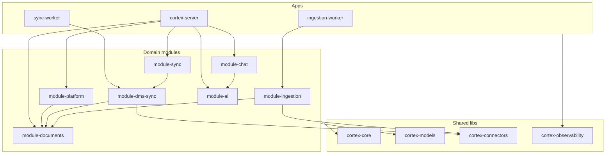
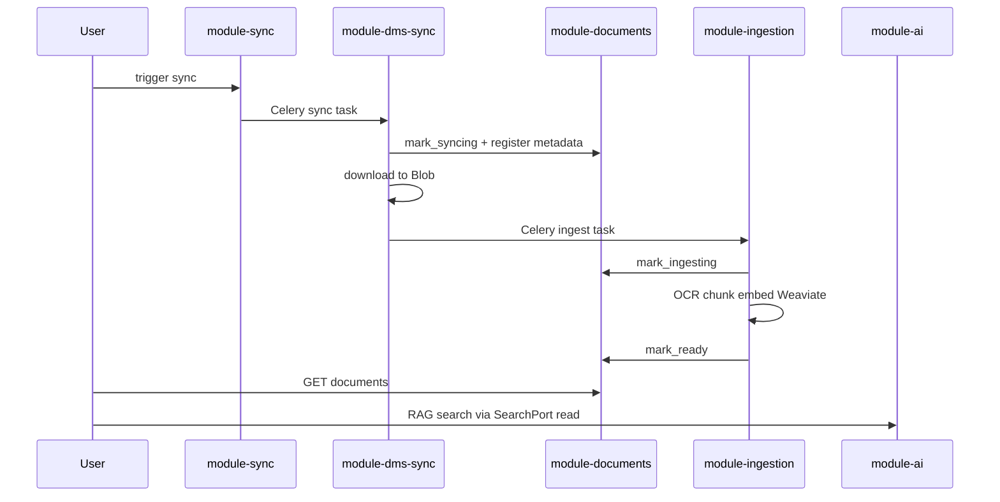

# Monolith Refactor Plan

Reference document before the big-bang refactor of the modular monolith. Covers architectural decisions, target structure, dependency rules, document lifecycle, and a validation checklist.

Related documents:

- [architecture/overview.md](../../architecture/overview.md) — target architecture and diagram
- [architecture/module-boundaries.md](../../architecture/module-boundaries.md) — module boundaries
- [decisions/README.md](../README.md) — ADR index (active decisions)
- [architecture.mmd](../../../../architecture.mmd) — Mermaid diagram

---

## 1. Context and motivation

Current state (after refactor): **7 domain modules** (`module-platform`, `module-documents`, `module-chat`, `module-sync`, `module-dms-sync`, `module-ingestion`, `module-ai`) + **3 shared lib packages** (`cortex-models`, `cortex-connectors`, `cortex-observability`) + **2 worker apps** (`sync-worker`, `ingestion-worker`) on top of `cortex-core`.

Identified problems (before refactor):

1. **Document ownership scattered** — `Document` ORM and status written by platform, alfresco, and ingestion modules.
2. **Platform too broad** — auth, cases, documents, chat, sync, audit, and AI delegation in one `PlatformModule`.
3. **Duplicated ORM** — worker modules had copies/re-exports of `Document`, `Case`, `SyncJob` models.
4. **Weaviate adapter duplicated** — read in AI, write in ingestion, without a shared contract.
5. **Name `module-alfresco`** — ties the module to one DMS; goal is DMS-agnostic sync.
6. **Single worker deployable** — sync and ingestion have different I/O vs CPU profiles; split required.

Refactor goal: **7 modules + 3 new lib packages + 2 worker apps**, clear boundaries, one ORM source of truth, facade per module.

---

## 2. Decided outcomes

| Topic | Decision |
|------|--------|
| Document ownership | New `module-documents` — full CRUD; **only it** changes `Document.status` |
| Platform split | `module-chat` + `module-sync`; `module-platform` → auth, cases, audit, system |
| Facades | Each module has its own `api.py`; shell only mounts routes |
| Chat | `module-chat` persists (Redis); `module-ai` generates stream |
| Weaviate | `SearchPort` in `cortex-core`; ingestion=write, ai=read |
| DMS module | `module-alfresco` → **`module-dms-sync`** |
| Core growth | New `libs/cortex-connectors` + `libs/cortex-observability` |
| ORM | New **`libs/cortex-models`** — single source of truth |
| Sync flow | `SyncOrchestrator` in `module-sync`; workers = executors |
| Messaging | Celery task queue remains (no domain events) |
| AI structure | Single `module-ai`, subfolders `agents/rag`, `agents/legal`, `agents/nlp` |
| Deploy | `apps/sync-worker` + `apps/ingestion-worker` (remove `cortex-worker`) |
| API | Breaking changes allowed — documented in section 10 |
| Enforcement | Import-linter updated immediately |
| Implementation | Big-bang PR, logical order in section 9 |

---

## 3. Target repo structure

```
.
├── libs/
│   ├── cortex-core/           # ports, enums, SearchPort, celery conv, settings
│   ├── cortex-models/         # User, Case, Document, SyncJob, AuditLog ORM
│   ├── cortex-connectors/     # Alfresco, Blob, OCR adapter impl
│   └── cortex-observability/  # metrics/tracing/logging hooks
├── packages/
│   ├── module-platform/       # auth, cases, audit, system
│   ├── module-documents/      # Document CRUD + lifecycle facade
│   ├── module-chat/           # threads, Redis, chat routes
│   ├── module-sync/           # SyncOrchestrator, job trigger/polling
│   ├── module-dms-sync/       # delta sync → Blob + PG (former alfresco)
│   ├── module-ingestion/      # OCR → chunk → embed → Weaviate
│   └── module-ai/
│       └── agents/
│           ├── rag/
│           ├── legal/
│           └── nlp/
└── apps/
    ├── cortex-server/         # thin composition root
    ├── sync-worker/           # Celery -Q sync
    └── ingestion-worker/      # Celery -Q ingestion
```

---

## 4. Diagrams

### 4.1 Module dependencies



### 4.2 Document lifecycle



**Rule:** worker modules must not perform direct ORM writes on `Document.status` — they call `DocumentsModule` lifecycle methods.

---

## 5. Dependency rules (import-linter)

| Module | May depend on |
|-------|------------------|
| `module-platform` | `cortex-core`, `cortex-models`, `module-documents.api`, `module-chat.api`, `module-sync.api`, `module-ai.api` |
| `module-documents` | `cortex-core`, `cortex-models` |
| `module-chat` | `cortex-core`, `module-ai.api` |
| `module-sync` | `cortex-core`, `cortex-models`, `module-documents.api` |
| `module-dms-sync` | `cortex-core`, `cortex-models`, `cortex-connectors`, `module-documents.api` |
| `module-ingestion` | `cortex-core`, `cortex-models`, `cortex-connectors`, `module-documents.api`, SearchPort |
| `module-ai` | `cortex-core`, SearchPort (read) |

**Forbidden:**

- any module → another module’s internal code (only `.api` and `schemas` via facade DTOs)
- worker modules → direct ORM write on `Document.status` (only `module-documents.api`)
- `module-ai` → platform / documents / sync / dms-sync / ingestion
- `module-dms-sync` → `module-ingestion` (chain via Celery task names only)

**Celery task constants** (`cortex_core.messaging.tasks`):

| Constant | Task name |
|-----------|-----------|
| `TASK_SYNC_CASE` | `module_dms_sync.tasks.sync_case_from_dms` |
| `TASK_INGEST_DOCUMENT` | `module_ingestion.tasks.ingest_document` |
| `TASK_FINALIZE_SYNC` | `module_dms_sync.tasks.finalize_sync_job` |

---

## 6. File mapping (old → new)

| Source (before) | Destination |
|---------------|-----------|
| `packages/module-platform/module_platform/models/*` | `libs/cortex-models/cortex_models/` |
| `module_platform/routes/documents.py` | `module-documents/module_documents/routes/` |
| `module_platform/routes/chat.py` + chat Redis store | `module-chat/` (`adapters/redis_chat_store.py`) |
| `module_platform/routes/sync.py` + `sync_trigger.py` + `SyncService` | `module-sync/` |
| `module_platform/api.py` (documents/chat/sync parts) | Facades in new modules |
| `packages/module-alfresco/` | `packages/module-dms-sync/` (rename) |
| `module_alfresco/adapters/alfresco_client.py` | `cortex-connectors` + thin wrapper |
| `module_ai/adapters/weaviate_store.py` + ingestion write | `SearchPort` in core + module adapters |
| `module_ai/agents/*` | `agents/rag/`, `agents/legal/`, `agents/nlp/` |
| `apps/cortex-worker/` | `apps/sync-worker/` + `apps/ingestion-worker/` |

---

## 7. DocumentsModule API (lifecycle)

Public facade in `module-documents/module_documents/api.py`:

### CRUD (HTTP)

| Method | Description |
|--------|------|
| `list_by_case(case_id, user)` | List documents for a case (auth check via case ownership) |
| `get(document_id, user)` | Document detail |
| `create(case_id, metadata)` | Register new document (internal/worker call) |
| `delete(document_id, user)` | Delete (soft delete later) |
| `trigger_reingest(document_id, user)` | Re-ingest enqueue |

### Lifecycle (internal only — worker calls)

| Method | Status transition | Caller |
|--------|---------------|---------|
| `mark_syncing(document_id)` | → `syncing` | `module-dms-sync` |
| `mark_ingesting(document_id)` | → `ingesting` | `module-ingestion` |
| `mark_ready(document_id, *, page_count?)` | → `ready` | `module-ingestion` |
| `mark_failed(document_id, reason)` | → `failed` | any worker |

---

## 8. SyncOrchestrator responsibilities

`module-sync` holds `SyncOrchestrator` and the `SyncModule` facade:

1. **trigger_sync(case_id, user)** — creates `SyncJob(PENDING)`, audit log, enqueues `TASK_SYNC_CASE`
2. **get_job(job_id, user)** — polling status for frontend
3. **Coordination** — knows order: sync task → (dms-sync enqueues ingest) → finalize

Workers (`module-dms-sync`, `module-ingestion`) are **dumb executors** — they do not create SyncJob, only update progress and call documents lifecycle.

`sync_trigger.py` and `SyncService` from platform move into `module-sync`.

---

## 9. Implementation order (big-bang checklist)

- [x] **Phase 1 — Foundation libs**
  - [x] `libs/cortex-models`
  - [x] `libs/cortex-connectors`
  - [x] `libs/cortex-observability`
  - [x] `SearchPort` in `cortex-core`

- [x] **Phase 2 — New modules**
  - [x] `module-documents`
  - [x] `module-chat`
  - [x] `module-sync`

- [x] **Phase 3 — Refactor existing**
  - [x] `module-alfresco` → `module-dms-sync`
  - [x] `module-ingestion`
  - [x] `module-ai`
  - [x] `module-platform`

- [x] **Phase 4 — Apps and tooling**
  - [x] `apps/sync-worker` + `apps/ingestion-worker`
  - [x] Removed `apps/cortex-worker` from workspace
  - [x] `pyproject.toml` + import-linter
  - [x] `Makefile`
  - [x] K8s — two worker deployments

- [x] **Phase 5 — Docs**
  - [x] `docs/engineering/architecture/module-boundaries.md`
  - [x] `architecture.mmd`
  - [x] `docs/engineering/architecture/overview.md`
  - [x] `docs/engineering/` + hexagonal layout (P0–P3 plan implemented)

---

## 10. API breaking changes

| Area | Before | After |
|--------|-----|-------|
| Documents | `module-platform` routes | `module-documents` router |
| Chat | `module-platform` routes | `module-chat` router |
| Sync | `module-platform` routes | `module-sync` router |
| RAG / Laws / Translate | `module-ai` routes | remains in `module-ai` |

`cortex-server/main.py` mounts all routers:

```python
app.include_router(platform_router)
app.include_router(documents_router)
app.include_router(chat_router)
app.include_router(sync_router)
app.include_router(ai_router)
```

---

## 11. Makefile / K8s / Docker changes

### Makefile

```makefile
dev-sync-worker:
	uv run celery -A sync_worker.tasks:celery_app worker -Q sync -n sync@%h

dev-ingestion-worker:
	uv run celery -A ingestion_worker.tasks:celery_app worker -Q ingestion -n ingest@%h

dev:
	# server + sync-worker + ingestion-worker + flower + web
```

### K8s

| Before | After |
|-----|-------|
| `infra/k8s/cortex-worker/` | `infra/k8s/sync-worker/` + `infra/k8s/ingestion-worker/` |
| 1 worker pod | 2 worker pods (different queue profile) |
| Flower uses `cortex-worker` image | Flower uses `sync-worker` or shared worker image |

---

## 12. Validation checklist

### 12.1 Architecture (ready for team)

- [x] `make lint-imports` passes
- [x] `make flct` / `uv run poe ci` passes
- [x] `uv sync --all-packages` without errors
- [x] Worker DI: `create_documents_module()` + `worker_deps.py`
- [x] K8s manifests: 2 worker deployments
- [x] No duplicated ORM models in worker packages (cortex-models)
- [x] Documentation: [architecture-ready.md](../../architecture/architecture-ready.md), [first-feature.md](../../how-we-work/first-feature.md)
- [ ] `make dev` — server + both workers + flower + web (manual smoke, before larger features)

### 12.2 Product (team implements features)

- [ ] Sync flow: trigger → dms-sync → ingestion → document status `ready`
- [ ] RAG search works via SearchPort (production adapter)
- [ ] Chat: persist in module-chat, stream from module-ai (E2E)
- [ ] Real AD/OIDC tenant

---

## 13. Risks and rollback

| Risk | Mitigation |
|-------|------------|
| Big-bang PR too large | Logical order in phase 9; commit per phase within PR |
| Import-linter cyclic dependencies | Facade-only cross-module imports |
| Celery task rename | Update constants in `cortex_core.messaging.tasks` |
| K8s downtime | Deploy both workers before deleting old one |

**Rollback:** keep git tag before merge; `cortex-worker` app can temporarily remain until split is validated.

---

## 14. What we deliberately do NOT do (for now)

- Domain events (`DocumentSynced`, `DocumentReady`) — Celery chain remains
- Saga/state machine in Redis — `SyncOrchestrator` is sufficient
- Multiple AI packages (rag/legal/nlp as separate deployables)
- Microservice extract — remains a mental test in module-boundaries
