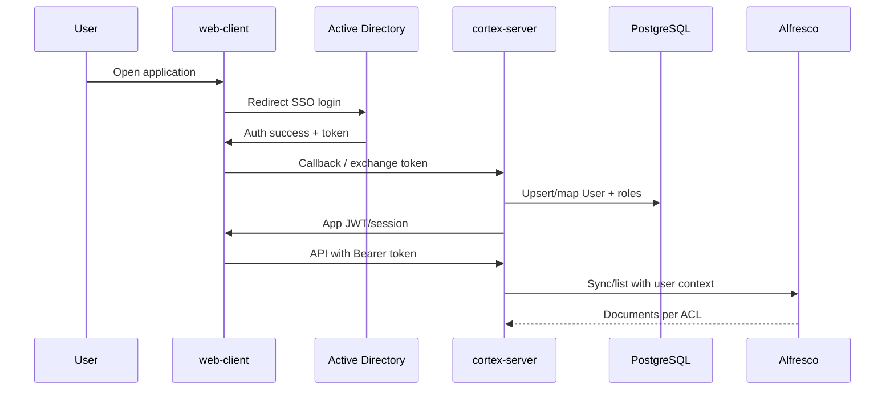

# Authentication and Authorization

## Target state (production)

1. User opens the **frontend** (`apps/web-client`).
2. Frontend **redirects** to **Active Directory / SSO**.
3. AD returns token/assertion to our **backend** (`cortex-server` / `module-platform`).
4. Backend validates token, maps AD identity to local user, issues **session/JWT** for the API.
5. User uses the app; **roles and login are handled by AD**, not a local password.

### Local users in the application

- `User` record in PostgreSQL (`cortex_models.User`) **exists** — for cases, audit, permissions.
- **No** direct password login in our app (MVP mock is temporary).
- Mapping: AD username / groups → local role and case access.

### Document authorization (Alfresco)

After successful SSO:

1. API calls carry JWT/session.
2. Sync/list/download goes through `module-dms-sync` with **user context**.
3. Alfresco returns **only documents the user may see** (DMS ACL).
4. The app does not “open” all documents — it respects DMS + case ownership in `module-platform` / `module-documents`.

## Technical contract (AD / OIDC)

| Item | Value |
|------|-------|
| Protocol | OpenID Connect (Authorization Code + PKCE) |
| Frontend redirect | `GET {AD_AUTHORITY}/oauth2/v2.0/authorize` with `client_id`, `redirect_uri`, `scope`, `code_challenge` |
| Redirect URI (dev) | `http://localhost:5174/auth/callback` |
| Backend callback | `POST /api/platform/auth/sso/callback` — body: `{ "code": "..." }` or query on GET proxy |
| Token exchange | Server-side: `client_secret` + `code` → ID/access token |
| Validation | JWKS / issuer + audience; extract `preferred_username` or `upn` → `User.ad_username` |
| App JWT | HS256, claims: `sub`, `role`, `exp` (same as mock login) |

### Environment variables (`.env`)

```bash
AD_TENANT_ID=
AD_CLIENT_ID=
AD_CLIENT_SECRET=
AD_AUTHORITY=https://login.microsoftonline.com/{tenant}
AD_REDIRECT_URI=http://localhost:5174/auth/callback
JWT_SECRET=dev-secret-change-in-production
JWT_ALGORITHM=HS256
AUTH_MOCK_ENABLED=true   # false in production — SSO only
```

### User mapping

1. From ID token: `ad_username` = `preferred_username` (normalized lowercase).
2. `UPSERT` into `users` by `ad_username`; `role` from AD group claim or default `lawyer`.
3. Audit: `action=login`, `resource_type=user`.

### Endpoints

| Method | Path | Description |
|--------|------|-------------|
| `GET` | `/api/platform/auth/sso/url` | Returns authorize URL for frontend redirect |
| `POST` | `/api/platform/auth/sso/callback` | Exchange code → app JWT |
| `POST` | `/api/platform/auth/login` | Mock (only if `AUTH_MOCK_ENABLED=true`) |

## MVP (current code)

- Mock login: `hmueller` / any password
- JWT: `Authorization: Bearer`, secret from `.env` (`JWT_SECRET`)
- Implementation: `module-platform` (`login` in facade/routes)

**Do not commit** production `JWT_SECRET`.

## Where to implement changes

| Topic | Location |
|-------|----------|
| SSO callback, token validation | `module-platform/services/auth_service.py` |
| JWT issuance / session | `module-platform/api.py`, `routes/auth.py` |
| `get_current_user` | `module-platform/deps.py` |
| User ORM, AD username field | `cortex-models/cortex_models/user.py` |
| Frontend redirect / token storage | `apps/web-client/src/context/AuthContext.tsx`, `LoginPage` |

## Sequence (Mermaid)



## Security rules

- Validate AD token on the server — frontend must not treat user as logged in without backend confirmation.
- Short TTL for access token; refresh per client policy.
- Audit login and sensitive actions in `AuditLog`.
