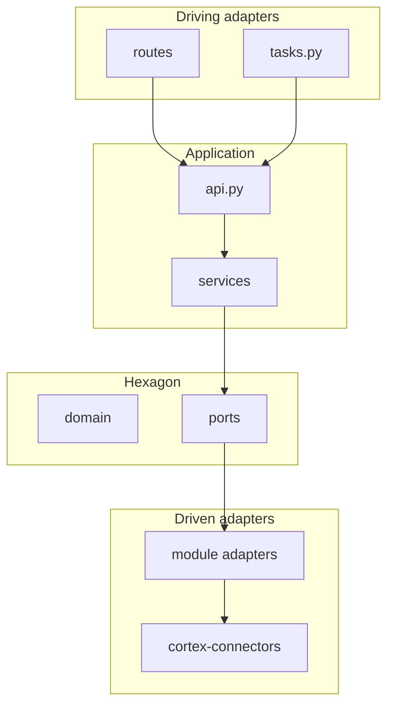

# Hexagonal Layout in the Cortex Monolith

Hexagonal architecture (ports & adapters) organizes code so **business logic does not depend on the database, HTTP, Alfresco, or Weaviate**. Dependencies point **inward** (toward ports), not toward external libraries.

Related: [ports-adapters.mdc](../../../.cursor/rules/ports-adapters.mdc) (shared ports in `cortex-core`; rule lives in repo root `.cursor/rules/`).

## Hexagonal basics

| Concept | Role in the monolith |
|---------|----------------------|
| **Domain** | Rules and entities without infrastructure (`domain/`) |
| **Ports** | Interfaces the domain requires (`ports/`, `cortex_core/ports/`) |
| **Adapters** | Port implementations (`adapters/`, `cortex-connectors/`) |
| **Driving adapters** | System entry: HTTP `routes/`, Celery `tasks.py` |
| **Application facade** | `api.py` — use-case orchestration for other modules or routes |



## Folder mapping (target per module)

```
module_{name}/
  domain/       # Pydantic entities, value objects, domain rules (no SQL/FastAPI)
  ports/        # Protocol: DocumentRepositoryPort, IdentityProviderPort, ...
  services/     # Use-case logic; receives ports via constructor
  adapters/     # Postgres, Redis, stub/prod port wrappers
  routes/       # Driving adapter — thin HTTP
  api.py        # Facade — public module contract (in-process)
  register.py   # Wire port implementations in ServiceRegistry
  schemas/      # HTTP DTO (request/response)
  tasks.py      # Celery driving adapter (worker modules)
```

### Outside the module hexagon

| Location | Reason |
|----------|--------|
| `apps/cortex-server/` | Composition root — mounts routers, middleware, lifespan |
| `libs/cortex-models/` | Shared ORM — not one module's domain |
| `libs/cortex-core/ports/` | External systems shared by multiple modules |
| `libs/cortex-connectors/` | Concrete stub/prod adapters for shared ports |

## Shared ports vs module ports

| Type | Where | Example |
|------|-------|---------|
| Shared (external system) | `cortex_core/ports/` + `cortex_connectors/` | `AlfrescoPort`, `SearchPort`, `OCRPort` |
| Module (per-domain persistence) | `module_*/ports/` + `module_*/adapters/` | `DocumentRepositoryPort`, `ChatStorePort` |

## Import rules

1. **`services/` must not import concrete `adapters/`** — receive port type via `__init__` or factory from `register.py`.
2. **Cross-module** — only `module_*/api.py`, never another module's `services/` or `adapters/`.
3. **Routes** — no SQL; call facade.
4. **Workers** — `Document.status` only via `DocumentsModule.mark_*()`.

## `api.py` vs `routes/`

- **`routes/`** = driving adapter (HTTP transport).
- **`api.py`** = application facade (use-case boundaries). Other modules call `DocumentsModule`, not route handlers.

## `register.py` and DI

Each module has `register_services(registry)` registering facade and services with injected ports. Composition root (`cortex-server/main.py`) creates `ServiceRegistry` at startup.

## Worker composition root (Celery)

HTTP and workers **do not share** a `ServiceRegistry` process — workers have their own bootstrap:

| Module | File | What it wires |
|--------|------|---------------|
| `module-documents` | `factory.py` → `create_documents_module()` | `DocumentService` + `PostgresDocumentRepository` |
| `module-dms-sync` | `worker_deps.py` → `register_worker_dependencies()` | documents facade, stub Alfresco/Blob |
| `module-ingestion` | `worker_deps.py` → `register_worker_dependencies()` | documents facade, stub OCR, Weaviate adapter |

**Rule:** in `tasks.py` never `DocumentsModule()` without services — always `create_documents_module()` or deps from `register_worker_dependencies()`.

```python
# module_dms_sync/tasks.py
from module_dms_sync.worker_deps import register_worker_dependencies

_worker_deps = register_worker_dependencies()
_documents = _worker_deps.documents
```

Cross-module lifecycle still via `DocumentsModule.mark_*()`.

## When **not** to force full hexagonal

- Module is only a **Celery executor** with one task and facade calls (`module-dms-sync` partially).
- **Thin CRUD** without external integrations — `services/` + one adapter is enough; `domain/` optional.
- Do **not** add empty `domain/` folders for show.

## Migration (strangler)

1. **New feature** — from the start: port → adapter → service → facade → route.
2. **Existing module** — one PR per module; pilot: `module-documents` → `module-platform` → `module-dms-sync` → others.
3. **`repositories/` / `infrastructure/`** — removed from modules; persistence lives in `adapters/` implementing `*Port`.

## Benefits for our monolith

- Swap Alfresco / AD / Weaviate without touching `services/`.
- Unit tests with fake ports.
- Same facade can become an HTTP client when extracting a service.
- Stronger boundary protection with import-linter.

## Checklist for new code

- [ ] Port defined before adapter?
- [ ] Service depends on port, not SQLAlchemy session in route?
- [ ] Facade exposes use-case; route is thin?
- [ ] Cross-module call via `api.py`?
- [ ] `make lint-imports` passes?
