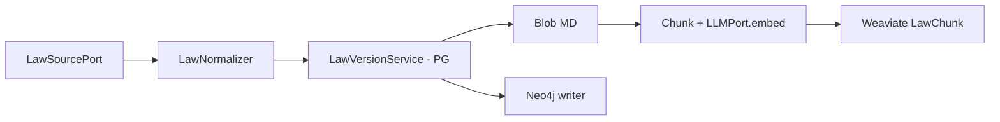

# Implementation Plan — Swiss Law Corpus (`module-law-sync`)

> **ADR:** [0009-law-corpus-sync.md](../decisions/0009-law-corpus-sync.md) (accepted)

Phased delivery for federal/cantonal law ingestion with versioning, Markdown archive, Neo4j graph, and Weaviate law search.

## Goals

1. Ingest laws from official APIs (primary) and scrapers (fallback)
2. Immutable version history with `valid_from` / `valid_to`
3. Federal and cantonal jurisdiction from day one
4. Keep case-document pipeline (`module-dms-sync` → `module-ingestion`) unchanged
5. `module-ai` reads only — agents and HTTP lookup consume synced data

## Non-goals (initial phases)

- Full cantonal source coverage (add connectors incrementally)
- Law RAG in chat UI (backend API first)
- Separate `law-sync-worker` deployable (reuse `sync-worker` until load requires split)

---

## Data model

### PostgreSQL (`cortex-models`)

```
LawCode
  id, code (e.g. "OR", "StGB"), title
  jurisdiction: FEDERAL | CANTONAL
  canton_code: nullable (ISO, e.g. "ZH")
  official_uri

LawProvision
  id, law_code_id
  ref (stable, e.g. "or-41") — unique per jurisdiction scope
  article_number, title

LawVersion (immutable)
  id, provision_id
  valid_from, valid_to (null = current)
  source: FEDLEX_API | SCRAPER
  source_version_id, content_checksum
  blob_path
  law_sync_job_id

LawSyncJob
  id, status, scope (e.g. "federal", "cantonal:ZH")
  started_at, finished_at, stats_json
```

**Versioning rule:** new publication → insert new `LawVersion` row; set `valid_to` on superseded version. Never overwrite rows.

### Blob layout

```
laws/
  federal/{law_code}/{ref}/{valid_from}.md
  cantonal/{canton_code}/{law_code}/{ref}/{valid_from}.md
```

Markdown includes YAML frontmatter: `ref`, `jurisdiction`, `canton`, `law_code`, `valid_from`, `valid_to`, `source`, `checksum`.

### Neo4j graph

```
(:Jurisdiction {level, canton_code?})
(:LawCode {code, title})-[:IN_JURISDICTION]->(:Jurisdiction)
(:Provision {ref, article})-[:PART_OF]->(:LawCode)
(:LawVersion {version_id, valid_from, valid_to})-[:VERSION_OF]->(:Provision)
(:LawVersion)-[:SUPERSEDES]->(:LawVersion)
(:LawVersion)-[:AMENDS|:CITES|:REPEALS]->(:Provision)
```

### Weaviate — `LawChunk` collection

Properties: `law_ref`, `version_id`, `jurisdiction`, `canton_code`, `law_code`, `article`, `valid_from`, `valid_to`, `content`, `chunk_index`.

Separate from existing `DocumentChunk` (ADR 0008).

---

## Module layout

```
packages/module-law-sync/
└── module_law_sync/
    ├── api.py                 # LawSyncModule facade
    ├── register.py
    ├── routes/                # POST /law-sync/jobs, GET /law-sync/jobs/{id}
    ├── schemas/
    ├── services/
    │   ├── law_corpus_sync.py      # orchestrator
    │   ├── law_normalizer.py       # raw → unified model
    │   └── law_version_service.py  # PG versioning rules
    ├── adapters/
    │   ├── blob_law_archive.py
    │   ├── neo4j_law_writer.py
    │   └── weaviate_law_writer.py  # LawSearchPort write side
    ├── tasks.py
    └── worker_deps.py
```

```
libs/cortex-core/cortex_core/ports/
  law_source.py    # LawSourcePort
  law_search.py    # LawSearchPort (read/write methods)
  law_graph.py     # LawGraphPort (optional phase 2)

libs/cortex-connectors/cortex_connectors/law/
  stub_source.py
  fedlex_api.py    # phase 4+
  scraper.py       # phase 5+
```

```
packages/module-ai/   (read side only)
  adapters/
    neo4j_law_reader.py      # refactor from neo4j_store.py
    weaviate_law_search.py   # LawSearchPort read
  agents/legal/
    law_link_agent.py        # temporal lookup
```

---

## Pipeline



Celery task constants (to add in `cortex_core.messaging.tasks`):

| Constant | Task | Queue |
|----------|------|-------|
| `TASK_SYNC_LAW_CORPUS` | `module_law_sync.tasks.sync_law_corpus` | `sync` |
| `TASK_SYNC_LAW_PROVISION` | `module_law_sync.tasks.sync_law_provision` | `sync` |
| `TASK_REINDEX_LAW_VERSION` | `module_law_sync.tasks.reindex_law_version` | `sync` |

---

## Phases

### Phase 0 — Decision and docs ✅

- [x] ADR 0009
- [x] This plan
- [x] Update `module-boundaries.md`, `feature-placement.md`, `architecture.mmd`
- [x] Update Cursor rules (`feature-placement.mdc`, `monolith-overview.mdc`)

### Phase 1 — Skeleton (no external APIs) ✅

**Deliverables:**

- [x] `packages/module-law-sync/` package with `pyproject.toml`, facade, stub tasks
- [x] ORM models + Alembic migration (`002_law_corpus_schema.py`)
- [x] Port stubs in `cortex-core` (`LawSourcePort`, `LawSearchPort`)
- [x] `StubLawSource` in `cortex-connectors`
- [x] Import-linter contract for 8 modules (11 contracts total)
- [x] `sync-worker` loads `module_law_sync.tasks`
- [x] HTTP: `POST /law-sync/jobs`, `GET /law-sync/jobs/{id}`
- [x] Unit tests: version service (immutable insert, supersede sets `valid_to`)

**Exit criteria:** `make lint-imports` and `make flct` green; stub job completes and writes one fixture provision.

### Phase 2 — Blob MD + PostgreSQL versioning

- `LawVersionService` creates immutable rows
- `BlobLawArchive` writes MD with frontmatter
- Manual trigger syncs stub provision end-to-end to PG + Blob
- Remove reliance on hardcoded `SEED_LAWS` for new data (keep seed for dev fallback)

### Phase 3 — Neo4j graph write

- `LawGraphPort` + writer adapter
- Upsert jurisdiction, code, provision, version nodes
- `SUPERSEDES` edges on new version
- `module-ai`: refactor read path to `neo4j_law_reader.py`; support `?as_of=` on `GET /laws/{ref}`

### Phase 4 — Weaviate `LawChunk` + embed

- `ensure_law_chunk_collection()` in shared Weaviate infra
- `WeaviateLawWriter` implements write side of `LawSearchPort`
- Chunk MD content, embed via `LLMPort`, upsert with version metadata
- `module-ai`: `WeaviateLawSearch` read adapter; optional `LawRagAgent` or extend orchestrator

### Phase 5 — Fedlex API connector

- `FedlexApiAdapter` implements `LawSourcePort`
- Delta sync by date / official version id
- `LawSyncJob.scope = federal` first

### Phase 6 — Cantonal sources + scraper fallback

- Per-canton `LawSourcePort` adapters or strategy pattern
- Scraper adapter with rate limit + caching
- Celery beat schedule for periodic delta sync

### Phase 7 — Production hardening

- Job retry / dead-letter policy
- Re-index from Blob (`TASK_REINDEX_LAW_VERSION`)
- Observability hooks (`cortex-observability`)
- Admin audit via `module-platform` (optional)

---

## HTTP routes

| Method | Path | Module | Purpose |
|--------|------|--------|---------|
| `POST` | `/law-sync/jobs` | `module-law-sync` | Trigger sync (scope, optional provision ref) |
| `GET` | `/law-sync/jobs/{id}` | `module-law-sync` | Job status |
| `GET` | `/laws/{ref}` | `module-ai` | Lookup (existing; add `as_of` query param) |

Law **consumption** stays under `/laws` in `module-ai`. Law **sync** lives under `/law-sync` in `module-law-sync`.

---

## Import-linter (target)

| Module | May depend on |
|--------|---------------|
| `module-law-sync` | `cortex-core`, `cortex-models`, `cortex-connectors` |
| `module-ai` | `cortex-core` (incl. `LawSearchPort` read — no law-sync import) |
| `sync-worker` | `module-dms-sync`, `module-law-sync`, `cortex-core` |

**Forbidden:**

- `module-law-sync` → `module-ai`, `module-ingestion`, `module-documents`
- `module-ai` → `module-law-sync` (including `.api` — use shared stores via ports only)
- Law sync writing to `Document.status` or `DocumentChunk`

---

## Testing strategy

| Layer | Tests |
|-------|-------|
| `LawVersionService` | Unit — supersede, temporal query, immutable rows |
| `LawNormalizer` | Unit — map stub/API payload to unified model |
| `LawSyncModule` | Integration — in-memory ports, no Neo4j/Weaviate |
| Celery tasks | Unit — mock services; one smoke test with stub connectors |
| `LawLinkAgent` | Unit — temporal filter with fake graph port |

---

## Open questions (track in ADR or issues)

1. **Neo4j full text in graph vs Blob-only text** — start with content in both; revisit if graph size is an issue
2. **Separate worker deployable** — trigger when sync queue SLO degrades
3. **Law sync authorization** — admin-only vs system role (coordinate with `module-platform` RBAC)

---

## Related documents

- [feature-placement.md](../how-we-work/feature-placement.md)
- [module-boundaries.md](../architecture/module-boundaries.md)
- [first-feature.md](../how-we-work/first-feature.md)
