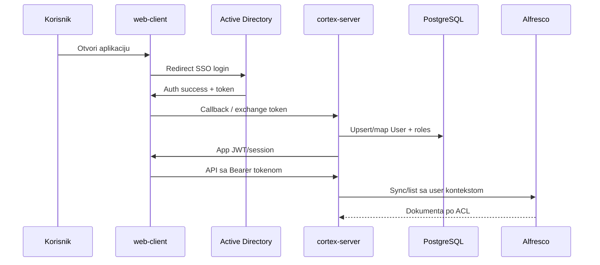

# Autentifikacija i autorizacija

## Ciljno stanje (produkcija)

1. Korisnik otvara **frontend** (`apps/web-client`).
2. Frontend **redirect** na **Active Directory / SSO**.
3. AD vraća token/assertion našem **backend-u** (`cortex-server` / `module-platform`).
4. Backend validira token, mapira AD identitet na lokalnog korisnika, izdaje **session/JWT** za API.
5. Korisnik koristi aplikaciju; **role i login handla AD**, ne lokalna lozinka.

### Lokalni korisnici u aplikaciji

- `User` zapis u PostgreSQL (`cortex_models.User`) **postoji** — za vezu sa cases, audit, permissions.
- **Nema** direktnog login-a lozinkom u našoj aplikaciji (MVP mock je privremen).
- Mapiranje: AD username / groups → lokalna rola i pristup predmetima.

### Autorizacija dokumenata (Alfresco)

Posle uspešnog SSO:

1. API pozivi nose JWT/session.
2. Sync/list/download ide preko `module-dms-sync` sa **korisničkim kontekstom**.
3. Alfresco vraća **samo dokumenta koja korisnik sme da vidi** (DMS ACL).
4. Naša aplikacija ne “otvara” sve dokumente — poštuje DMS + case ownership u `module-platform` / `module-documents`.

## Tehnički contract (AD / OIDC)

| Stavka | Vrednost |
|--------|----------|
| Protokol | OpenID Connect (Authorization Code + PKCE) |
| Frontend redirect | `GET {AD_AUTHORITY}/oauth2/v2.0/authorize` sa `client_id`, `redirect_uri`, `scope`, `code_challenge` |
| Redirect URI (dev) | `http://localhost:5174/auth/callback` |
| Backend callback | `POST /api/platform/auth/sso/callback` — body: `{ "code": "..." }` ili query na GET proxy |
| Token exchange | Server-side: `client_secret` + `code` → ID/access token |
| Validacija | JWKS / issuer + audience; izvući `preferred_username` ili `upn` → `User.ad_username` |
| App JWT | HS256, claims: `sub`, `role`, `exp` (kao mock login) |

### Env varijable (`.env`)

```bash
AD_TENANT_ID=
AD_CLIENT_ID=
AD_CLIENT_SECRET=
AD_AUTHORITY=https://login.microsoftonline.com/{tenant}
AD_REDIRECT_URI=http://localhost:5174/auth/callback
JWT_SECRET=dev-secret-change-in-production
JWT_ALGORITHM=HS256
AUTH_MOCK_ENABLED=true   # false u produkciji — samo SSO
```

### Mapiranje korisnika

1. Iz ID tokena: `ad_username` = `preferred_username` (normalizovano lowercase).
2. `UPSERT` u `users` po `ad_username`; `role` iz AD group claim ili default `lawyer`.
3. Audit: `action=login`, `resource_type=user`.

### Endpointi

| Metoda | Putanja | Opis |
|--------|---------|------|
| `GET` | `/api/platform/auth/sso/url` | Vraća authorize URL za frontend redirect |
| `POST` | `/api/platform/auth/sso/callback` | Razmena code → app JWT |
| `POST` | `/api/platform/auth/login` | Mock (samo ako `AUTH_MOCK_ENABLED=true`) |

## MVP (trenutno u kodu)

- Mock login: `hmueller` / proizvoljna lozinka
- JWT: `Authorization: Bearer`, secret iz `.env` (`JWT_SECRET`)
- Implementacija: `module-platform` (`login` u facade/routes)

**Ne commitovati** produkcioni `JWT_SECRET`.

## Gde implementirati promene

| Tema | Lokacija |
|------|----------|
| SSO callback, token validacija | `module-platform/services/auth_service.py` |
| JWT izdavanje / session | `module-platform/api.py`, `routes/auth.py` |
| `get_current_user` | `module-platform/deps.py` |
| User ORM, AD username polje | `cortex-models/cortex_models/user.py` |
| Frontend redirect / token storage | `apps/web-client/src/context/AuthContext.tsx`, `LoginPage` |

## Sekvenca (Mermaid za dokumentaciju)



## Bezbednosna pravila

- Validacija AD tokena na serveru — frontend ne smatra korisnika logovanim bez backend potvrde.
- Kratak TTL za access token; refresh po politikama klijenta.
- Audit login i osetljive akcije u `AuditLog`.
