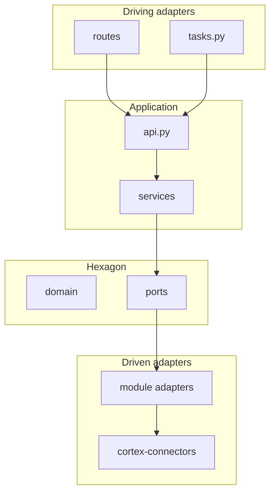

# Hexagonal layout u Cortex monolitu

Hexagonal arhitektura (ports & adapters) organizuje kod tako da **poslovna logika ne zavisi od baze, HTTP-a, Alfresca ili Weaviate-a**. Zavisnosti idu **ka unutra** (prema portovima), ne ka spoljnim bibliotekama.

Povezano: [ports-adapters](../../../.cursor/rules/ports-adapters.mdc) (shared portovi u `cortex-core`).

## Šta je hexagonal (kratko)

| Pojam | Uloga u monolitu |
|-------|------------------|
| **Domain** | Pravila i entiteti bez infrastrukture (`domain/`) |
| **Ports** | Interfejsi koje domen traži (`ports/`, `cortex_core/ports/`) |
| **Adapters** | Implementacije portova (`adapters/`, `cortex-connectors/`) |
| **Driving adapters** | Ulaz u sistem: HTTP `routes/`, Celery `tasks.py` |
| **Application facade** | `api.py` — use-case orchestration za drugi modul ili routes |



## Mapiranje foldera (ciljno po modulu)

```
module_{name}/
  domain/       # Pydantic entiteti, value objects, domenska pravila (bez SQL/FastAPI)
  ports/        # Protocol: DocumentRepositoryPort, IdentityProviderPort, ...
  services/     # Use-case logika; prima portove kroz constructor
  adapters/     # Postgres, Redis, stub/prod wrapperi portova
  routes/       # Driving adapter — tanak HTTP
  api.py        # Facade — javni ugovor modula (in-process)
  register.py   # Wire port implementacija u ServiceRegistry
  schemas/      # HTTP DTO (request/response)
  tasks.py      # Celery driving adapter (worker moduli)
```

### Šta ostaje izvan hexagona modula

| Lokacija | Razlog |
|----------|--------|
| `apps/cortex-server/` | Composition root — montira routere, middleware, lifespan |
| `libs/cortex-models/` | Deljeni ORM — nije domen jednog modula |
| `libs/cortex-core/ports/` | Spoljni sistemi deljeni više modula (Alfresco, OCR, SearchPort) |
| `libs/cortex-connectors/` | Konkretni stub/prod adapteri za shared portove |

## Shared portovi vs modul portovi

| Tip | Gde | Primer |
|-----|-----|--------|
| Shared (spoljni sistem) | `cortex_core/ports/` + `cortex_connectors/` | `AlfrescoPort`, `SearchPort`, `OCRPort` |
| Modul (per-domen persistence) | `module_*/ports/` + `module_*/adapters/` | `DocumentRepositoryPort`, `ChatStorePort` |

## Pravila importa

1. **`services/` ne importuje konkretne `adapters/`** — prima port tip kroz `__init__` ili factory iz `register.py`.
2. **Cross-module** — samo `module_*/api.py`, nikad `services/` ili `adapters/` drugog modula.
3. **Routes** — ne sadrže SQL; pozivaju facade.
4. **Workeri** — `Document.status` samo preko `DocumentsModule.mark_*()`.

## `api.py` vs `routes/`

- **`routes/`** = driving adapter (HTTP transport).
- **`api.py`** = application facade (use-case granice). Drugi moduli zovu `DocumentsModule`, ne route handler.

## `register.py` i DI

U P2+ svaki modul ima `register_services(registry)` koji registruje facade i servise sa injektovanim portovima. Composition root (`cortex-server/main.py`) kreira `ServiceRegistry` pri startu.

## Worker composition root (Celery)

HTTP i workeri **ne dele** `ServiceRegistry` proces — workeri imaju svoj bootstrap:

| Modul | Fajl | Šta wire-uje |
|-------|------|--------------|
| `module-documents` | `factory.py` → `create_documents_module()` | `DocumentService` + `PostgresDocumentRepository` |
| `module-dms-sync` | `worker_deps.py` → `register_worker_dependencies()` | documents facade, stub Alfresco/Blob |
| `module-ingestion` | `worker_deps.py` → `register_worker_dependencies()` | documents facade, stub OCR, Weaviate adapter |

**Pravilo:** u `tasks.py` nikad `DocumentsModule()` bez servisa — uvek `create_documents_module()` ili deps iz `register_worker_dependencies()`.

```python
# module_dms_sync/tasks.py
from module_dms_sync.worker_deps import register_worker_dependencies

_worker_deps = register_worker_dependencies()
_documents = _worker_deps.documents
```

Cross-module lifecycle i dalje preko `DocumentsModule.mark_*()`.

## Kada **ne** forsirati pun hexagonal

- Modul je samo **Celery executor** sa jednim taskom i pozivom facade drugog modula (`module-dms-sync` delimično).
- **Tanak CRUD** bez spoljnih integracija — dovoljno `services/` + jedan adapter; `domain/` opciono.
- **Ne uvoditi** `domain/` samo radi praznog foldera.

## Migracija (strangler)

1. **Novi feature** — od starta: port → adapter → service → facade → route.
2. **Postojeći modul** — jedan PR po modulu; pilot: `module-documents` → `module-platform` → `module-dms-sync` → ostali.
3. **`repositories/`** — postepeno postaju `adapters/` koji implementiraju `*RepositoryPort`.

## Prednosti za naš monolit

- Zamena Alfresco / AD / Weaviate bez diranja `services/`.
- Unit testovi sa fake portovima.
- Isti facade kasnije može postati HTTP klijent pri extract-u servisa.
- Jača zaštita granica uz import-linter.

## Checklist za novi kod

- [ ] Port definisan pre adaptera?
- [ ] Service zavisi od porta, ne od SQLAlchemy session u route?
- [ ] Facade izlaže use-case, route je tanak?
- [ ] Cross-module poziv ide preko `api.py`?
- [ ] `make lint-imports` prolazi?
